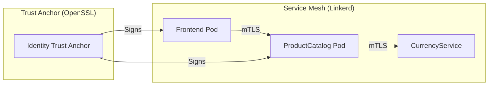
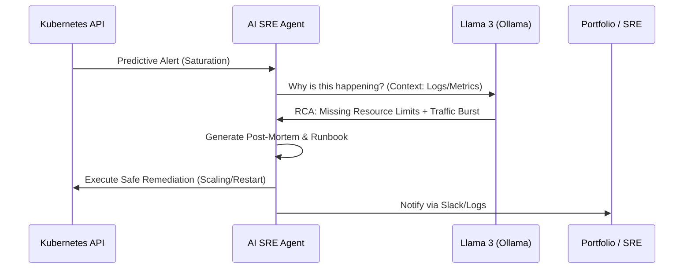

# System Architecture: AI4ALL-SRE Laboratory 🏗️

This document provides a deep-tech dive into the architectural patterns and engineering standards implemented in the AI4ALL-SRE laboratory. These patterns reflect the operational excellence standards of **Tier-1 Tech Organizations** (Google, OpenAI, Meta).

## 🔒 Zero Trust Networking (ZTN)

The laboratory implements a **Zero Trust** security model using the **Linkerd Service Mesh**. 

### Identity-Based Security
Unlike traditional perimeter-based security, our laboratory assumes a "breach-ready" state:
- **mTLS by Default**: Every microservice connection is encrypted and authenticated via mutual TLS.
- **Service Identity**: Linkerd provides a cryptographically secure identity to every pod using Kubernetes ServiceAccounts as the root of trust.
- **Policy-as-Code**: Traffic is strictly governed by `NetworkPolicies` and Linkerd `ServiceProfiles`.

## 📈 Machine-to-Machine (M2M) Resilience

In a world governed by AI agents, **M2M traffic** can surge by 100x in milliseconds. We protect the Kubernetes Control Plane using **API Priority & Fairness (APF)**.

### APF Implementation
We've implemented custom `FlowSchemas` and `PriorityLevelConfigurations` to categorize AI-driven traffic:
- **m2m-ai-agents**: A dedicated flow for autonomous agents.
- **m2m-low-priority**: A priority level that ensures AI-driven bursts do not starve critical system components (e.g., Kubelet, Controllers).
- **Hand-shaking & Hand-size**: Advanced queuing algorithms to ensure fairness across multiple concurrent AI agents.

## 🤖 Hyper-Autonomous SRE Lifecycle

The "Heart" of the laboratory is the **Autonomous AI SRE Agent**, which follows the **"Zero-Touch" Operations** standard.

### The Feedback Loop
1. **Saturation Prediction**: The agent analyzes metrics to predict failures *before* they happen (e.g., CPU trending toward saturation).
2. **Root Cause Analysis (RCA)**: Powered by **Llama 3**, the agent correlates metrics, logs, and events.
3. **Artifact Generation**:
    - **Post-Mortems**: Instant markdown generation documenting the timeline and impact.
    - **Runbooks**: Dynamic, context-aware troubleshooting guides.
4. **Auto-Remediation**: Controlled execution of safe, whitelisted operations (e.g., `Rollout Restart`).

## 🛡️ Shift-Left Security & Governance

The laboratory adheres to the **"Secure by Design"** principle:
- **SBOM Generation**: Automated Software Bill of Materials via **Trivy**.
- **Kyverno Policy-as-Code**: Enforces best practices (no root, resource limits required) at the admission controller level.

---

## 🔮 Future Roadmap: The "Elite" Evolution

To maintain the laboratory at the cutting edge of industry standards (OpenAI, Anthropic, Google), the following "Next-Gen" patterns are currently being integrated:

### 1. Domain-Specific SRE Language Models
While general-purpose LLMs are powerful, the next evolution involves **Domain-Specific Training**:
- **Pros**: Reduced hallucinations in critical infrastructure commands, higher "Technical Context Density," and lower inference latency.
- **Goal**: Fine-tuning Llama 3 on 10,000+ real-world incident post-mortems and Kubernetes API schemas to create a specialized "SRE-Kernel" model.

### 2. Multi-Agent SRE Teams (Team-of-Rivals)
Following the emerging "Agentic Workflow" pattern, we are moving toward a **Multi-Agent Orchestration** model:
- **The Analyst Agent**: Deep-dives into OTel metrics and Loki logs to find the Root Cause.
- **The Security Warden**: Validates every proposed remediation against Kyverno and Linkerd policies.
- **The Orchestrator**: Synchronizes the agents, prevents "Debate Loops," and communicates with human engineers.
- **Impact**: This approach mimics a high-performing "Human SRE Team" but operates at machine speed.

### 3. Hardware Sovereignty: Local QLoRA Execution
To demonstrate the feasibility of these "Elite" patterns without massive cloud spend, the laboratory includes a roadmap for **Local Fine-Tuning**:

- **Optimization Pattern**: Using **QLoRA (4-bit Quantized Low-Rank Adaptation)** to reduce VRAM footprint.
- **Hardware Profile (Proven Path)**:
    - **GPU**: NVIDIA RTX 3060 (12GB VRAM) — The critical threshold for 4-bit Llama 3 8B training.
    - **System RAM**: 128GB DDR4 — Enabling massive dataset preparation and CPU-offloading.
    - **Compute**: Ryzen 9 5950X (16C/32T) — Parallelizing data tokenization and preprocessing.
- **Tooling**: **Unsloth** and **Axolotl** for memory-efficient gradient checkpointing.
- **Significance**: This proves the ability to handle **Sensitive Data Sovereignty**—training on proprietary logs without leaking them to external APIs.

---
*This laboratory isn't just a project; it's a blueprint for the future of hyper-resilient, AI-native infrastructure.*
