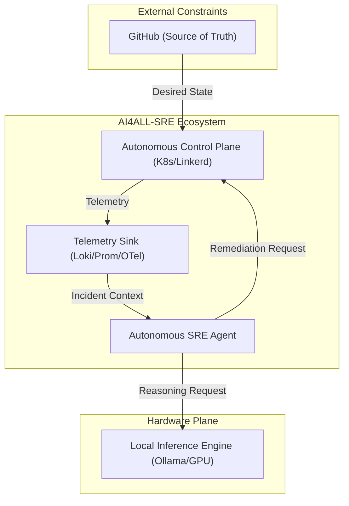
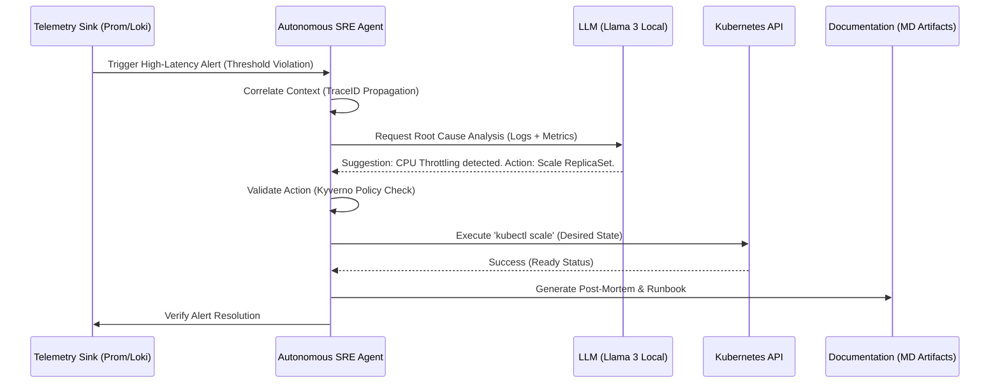

# Architecture Specification: AI4ALL-SRE Autonomous Control Plane 🏗️

This document defines the high-fidelity technical architecture of the AI4ALL-SRE Laboratory. It is structured according to the **C4 Model** for architectural visualization and focuses on system resilience, data lineage, and failure mode antifragility.

## 🗺️ C4 Model - Level 1: System Context

The AI4ALL-SRE Laboratory operates as an autonomous enclave that bridges the gap between raw telemetry and corrective action.

## 📦 C4 Model - Level 2: Container (Data Mesh)

The system is a distributed **Data Mesh** where state is synchronized across asynchronous observers.

- **Telemetry Sink**: Prometheus (Metrics) and Loki (Logs).
- **Messaging Hub**: Kubernetes API Server (Serving as the Global State Orchestrator).
- **Agent Memory**: FAISS-powered Vector Store (Context retrieval).

## 🧩 C4 Model - Level 3: Component (Agent Reasoning)

The Autonomous SRE Agent is composed of three primary functional blocks:
1.  **Context Collector**: Aggregates logs, metrics, and K8s events into a unified Trace-bound context.
2.  **Reasoning Engine**: Uses Llama 3 (optimized via QLoRA) for causal inference and Root Cause Analysis.
3.  **Executor**: Validates actions against whitelisted namespaces and executes non-idempotent API calls.

## ⚡ Automatic Incident Response (Sequence Diagram)

This diagram illustrates the lifecycle of a "Predictive Saturation" alert, from detection to automated artifact generation.

## 🧬 Causal Tracing & Lineage

We implement **Global TraceID Propagation** to ensure observability across the entire decision loop:
- **Injection**: Every fired alert is assigned a unique `Incident-UID`.
- **Propagation**: This ID is injected into every LLM prompt and every subsequent Kubernetes API call metadata.
- **Auditability**: We can trace an automated $50 scaling event back to the exact Log Line that triggered the reasoning engine.

## 🛡️ Failure Modes & Antifragility

We follow the principle of **Fail-Safe Autonomy**:

### 1. LLM Saturation (Backpressure)
- **Problem**: Local inference becomes a bottleneck.
- **Remediation**: Jittered Exponential Backoff (ADR-002).
- **Hardwired Fallback**: If inference latency (p99) exceeds 60s, the Agent enters **"Watchtower Mode"**—it continues to log and analyze, but suspends all automated write-actions, alerting the human operator.

### 2. Mesh Partitioning
- **Problem**: Sidecar identity failure.
- **Antifragility**: The Linkerd proxy caches identities. The "Data Plane" continues mTLS enforcement even if the "Control Plane" is temporarily partitioned.

## 📈 Scalability & Bottlenecks
- **Vector Search**: Current FAISS indexing is optimized for **p99 Query Latency** over write-throughput.
- **Telemetry Sink**: Loki buffer sizes are tuned for "Burst Handling" to prevent log loss during high-concurrency simulation.

---
*Document Version: 3.0.0 (Principal Architect Edition)*
