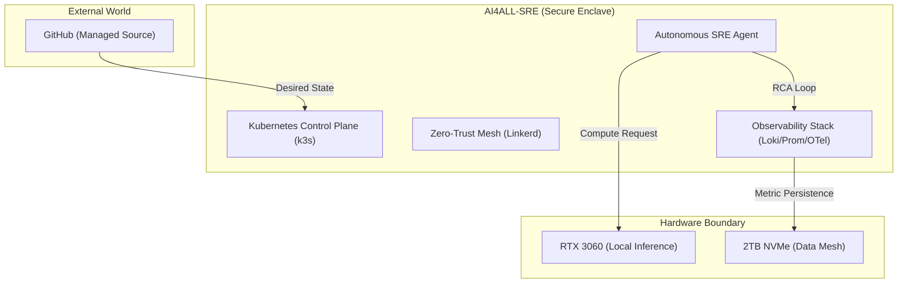
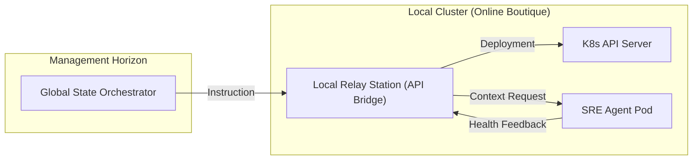

# Architecture Specification: AI4ALL-SRE 🏗️

This document defines the high-fidelity technical architecture of the AI4ALL-SRE Laboratory. It is structured to provide a "Staff-level" view of system boundaries, failure modes, and data lineage.

## 🗺️ System Boundary & Context (C4 Model - Level 1)

The laboratory operates as an autonomous enclave. Our responsibility ends at the **Provisioning Boundary** (Local Hypervisor) and the **Inference API Boundary** (Local Ollama/LLM).

## 🔄 Data Mesh & Lineage

State synchronization across asynchronous agents is handled via a **Distributed State Mesh**:
1.  **Metric Ingestion**: OTel Collectors scrape system state and propagate `TraceIDs` globally.
2.  **State Consolidation**: Prometheus and Loki correlate these traces into a unified "Incident Context".
3.  **Agent Memory**: Asynchronous agents retrieve this context from the **Vector Memory** (ADR-001) to ensure historical lineage is preserved during reasoning.

## 🧬 Causal Tracing (Global Propagation)

To achieve "Science-Fiction" level observability, we implement **Global TraceID Propagation**. A single `TraceID` travels across:
- **Terminal (Input)**: Every automated script execution is tagged.
- **Microservices (Network)**: Linkerd sidecars inject headers (`X-B3-TraceId`) into all gRPC/HTTP traffic.
- **Agent Reasoning (AIOps)**: The LLM output is appended with the parent `TraceID`, allowing us to trace a self-healing action back to the specific line of code or user request that triggered it.

## 🛡️ Failure Modes & Antifragility

We assume the system *will* fail. Our goal is **Antifragility**—improving the system through failures.

### 1. LLM Backpressure & Rate-Limiting
When the local LLM (Ollama) is saturated:
- **Pattern**: **Jittered Exponential Backoff**.
- **Implementation**: The AI Agent retries with a base delay of 2s, doubling with a 10% jitter until a 5-retry limit is reached.
- **Circuit Breaker**: If the LLM error rate exceeds 20% in the last 60 seconds, the "Autonomous Remediation" layer is **tripped (opened)**, defaulting the system to "Human-Operator" mode.

### 2. Zero-Trust Partitioning (Linkerd Fault-Tolerance)
- **Failure Mode**: Control Plane failure.
- **Antifragility**: Current proxy identities are cached. The system continues to operate in mTLS mode using the last known secure state, ensuring that a Mesh failure doesn't result in a total blackout.

## 🧩 Component Interaction (C4 Model - Level 2)

The interaction between the **Global State Orchestrator** and our local resources:

---
*Document Version: 2.0.0 (Elite Edition)*
