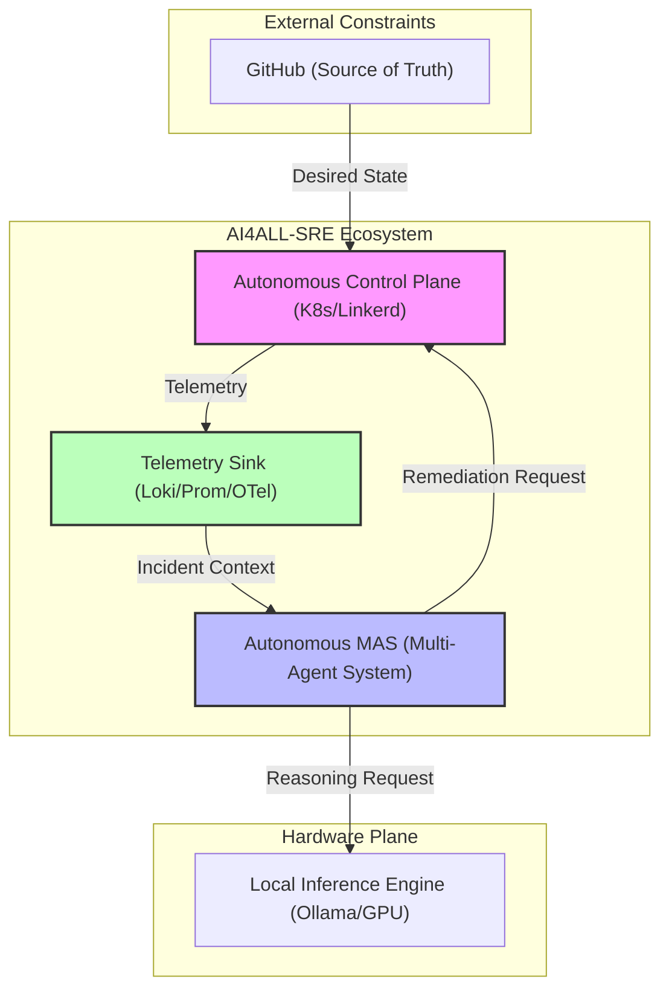
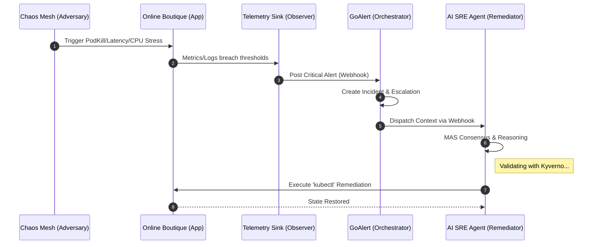

# Architecture Specification: AI4ALL-SRE Autonomous Control Plane 🏗️

This document defines the high-fidelity technical architecture of the AI4ALL-SRE Laboratory. It is structured according to the **C4 Model** for architectural visualization and focuses on system resilience, data lineage, and failure mode antifragility.

---

## 🏛️ Core Design Principles

The laboratory is built on four architectural non-negotiables:

1.  **Local-First Autonomy**: All reasoning (LLM) and data storage happen within the laboratory perimeter to ensure 100% data sovereignty and low-latency decision loops.
2.  **M2M Zero-Trust**: Machine-to-Machine communication is cryptographically secured via Linkerd. No agent action is executed without an verified, mTLS-backed identity.
3.  **Consensus-Based Remediation**: Automated fixes require consensus from specialized domain agents (Network, DB, Compute) to prevent "Agentic Hallucination."
4.  **Audit-Ready Lineage**: Every automated action carries a global `Incident-UID`, allowing a direct trace from a `kubectl` command back to the original telemetry anomaly.

---

## 🗺️ C4 Model - Level 1: System Context

The AI4ALL-SRE Laboratory operates as an autonomous enclave that bridges the gap between raw telemetry and corrective action.

## 📦 C4 Model - Level 2: Container (Data Mesh)

The system is a distributed **Data Mesh** where state is synchronized across asynchronous observers.

- **Telemetry Sink**: Prometheus (Metrics) and Loki (Logs) managed as a unified observability fabric.
- **Messaging Hub**: Kubernetes API Server serving as the Global State Orchestrator.
- **Agent Memory**: FAISS-powered Vector Store for high-speed context retrieval and decision logging.

## 🧩 C4 Model - Level 3: Component (MAS Reasoning)

The Autonomous SRE Agent is composed of a **Multi-Agent System (MAS)** as defined in [ai_agent.py](file:///home/fb/Workspace/ai4all-sre/ai_agent.py):
1.  **Specialist Swarm**:
    - **NetworkAgent**: Focuses on ingress, DNS, and service mesh (Linkerd) issues.
    - **DatabaseAgent**: Focuses on storage persistence, connection pool saturation, and query latency.
    - **ComputeAgent**: Focuses on CPU/Memory headroom, OOMKills, and scheduling constraints.
2.  **Director Agent (Consensus Engine)**: Synthesizes expert advice via a secondary LLM pass to determine the final Root Cause and optimal action.
3.  **Executor**: Validates actions against safety guardrails (forbidden keywords/namespaces whitelisting) and executes non-idempotent API calls (e.g., `rollout restart`).

---

## 📂 Architecture Decision Records (ADR) Index

The system's evolution is documented through ADRs to ensure design lineage:

| ADR | Title | Status | Description |
| :--- | :--- | :--- | :--- |
| [ADR-001](./adr/ADR-001-vector-db-selection.md) | Vector DB Selection | **Accepted** | Defines the shift from ephemeral storage to persistent local vectorization. |
| [ADR-002](./adr/ADR-002-llm-orchestration.md) | LLM Orchestration | **Accepted** | Protocols for local inference (Ollama) andMAS consensus. |

---

## ⚡ Complete Alerting Chain (Sequence Diagram)

This diagram shows the end-to-end flow from failure injection to autonomous remediation.

---

## 🛡️ Failure Modes & Antifragility

### 1. LLM Saturation
- **Strategy**: Jittered Exponential Backoff.
- **Watchtower Mode**: If inference exceeds 60s, the Agent suspends write-actions and enters "Monitor-Only" state to prevent accidental cascading failures.

### 2. Mesh Partitioning
- **Strategy**: Linkerd proxy identity caching.
- **Result**: The Data Plane continues mTLS enforcement even if the Control Plane is temporarily unreachable.

---
*Document Version: 3.1.0 (Enterprise Stability Edition)*
