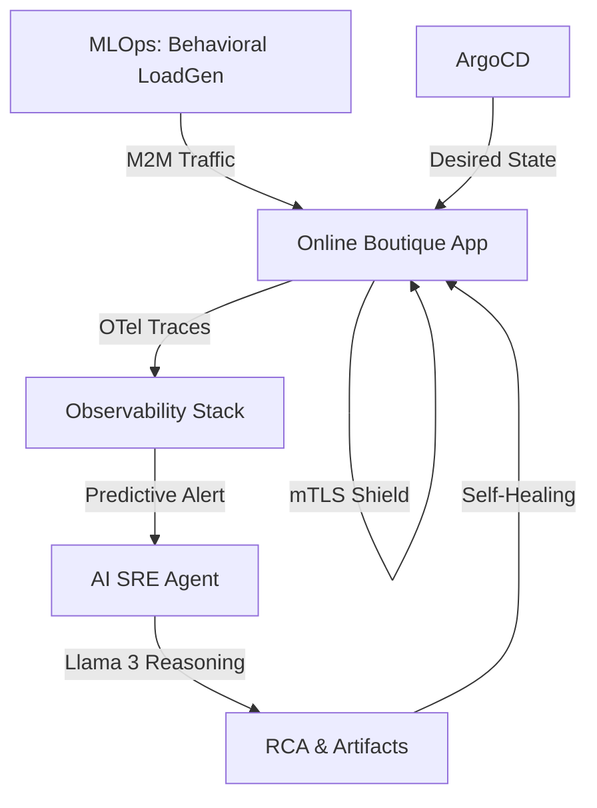

# AI-Driven SRE Laboratory: Big-Tech Operational Excellence 🚀

This repository houses a high-fidelity **AI-Driven SRE Laboratory** designed to simulate, monitor, and autonomously manage complex microservices environments. 

The project implements **Tier-1 Tech Standards** (Google, OpenAI, Meta) across the full stack of **SRE, DevSecOps, and AIOps**.

## 🌟 Elite Engineering Standards

This laboratory evolves through four critical phases of operational maturity:
- **Zero-Touch Operations**: Hyper-autonomous SRE Lifecycle using **Llama 3** for RCA, Post-Mortems, and self-healing.
- **Zero Trust Networking**: Identity-based mTLS security via **Linkerd Service Mesh**.
- **M2M Resilience**: Control Plane protection using Kubernetes **API Priority & Fairness (APF)** to survive AI traffic surges.
- **Progressive Delivery**: Canary deployments and automated rollbacks via **Argo Rollouts**.

## 🏗️ Technical Architecture

For a deep-dive into the system design, Zero Trust model, and autonomous reasoning engine, see [ARCHITECTURE.md](./ARCHITECTURE.md).

### High-Level System Flow


## 🛠️ Core Capabilities

### 🤖 Hyper-Autonomous SRE (AIOps)
- **Predictive RCA**: Predicts saturation before it impacts users.
- **Auto-Artifact Generation**: Generates incident Post-Mortems and Runbooks in real-time.
- **Safety Guardrails**: Action-validation layer to prevent destructive AI operations.

### 🛡️ DevSecOps & Zero Trust
- **mTLS Everywhere**: Identity-based encryption via Linkerd.
- **Policy-as-Code**: **Kyverno** admission controller enforcing enterprise-grade security.
- **SBOM & CVE Scanning**: Automated vulnerability management via **Trivy**.

### 📈 Elastic Reliability & MLOps
- **Behavioral Simulation**: Real-world user journey simulations and "Flash Sale" stress tests.
- **M2M Resilience**: Shielding the Kubernetes API from high-concurrency AI agent traffic.

## 🚀 Deployment & Operations

### Quick Start
```bash
./setup-all.sh
```

### Validation & Dashboards
```bash
./start-dashboards.sh  # Access Grafana, Loki, and ArgoCD
./scripts/validate.sh   # Run the SRE Health Check
```

---
*Developed to master the standards that are reshaping the tech world.*
