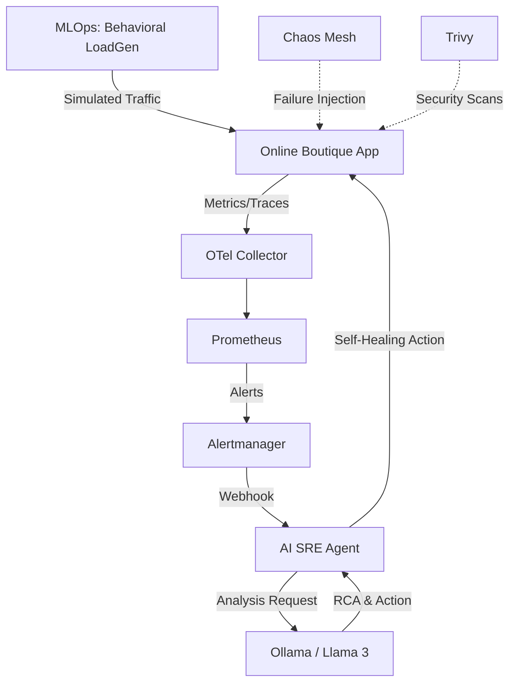
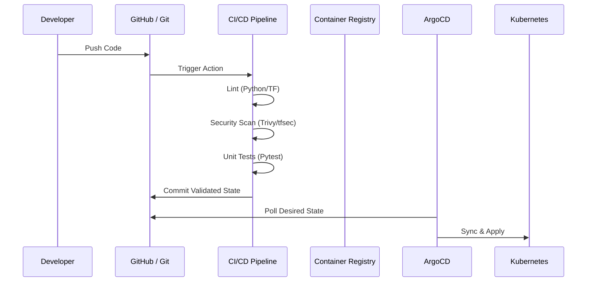

# AI4ALL-SRE Laboratory 🚀

Welcome to the **AI4ALL-SRE** project! This is a state-of-the-art laboratory integrating the latest best practices in **SRE, DevSecOps, GitOps, AIOps, MLOps, and Platform Engineering**.

## 🏗️ Technical Architecture

### System Flow
The laboratory implements a full feedback loop from traffic simulation to AI-remediation:



### CI/CD Lifecycle (Google-level Best Practices)


## 🛠️ Advanced Features

### 🤖 Self-Healing AIOps
The **AIOps Agent** is not just an observer. Integrated with the Kubernetes API and powered by Llama 3, it can:
- **Interpret Alerts**: Provides a human-readable theory of Why an alert is firing.
- **Automated Actions**: If confident, it can execute `Rollout Restarts` or `Scale Up` operations to mitigate incidents before a human even responds.

### 📈 MLOps: Behavioral Simulation
Standard load generators produce flat traffic. Our **Behavioral LoadGen** simulates:
- **Normal Flow**: Realistic user journeys (Browse -> Cart -> Checkout).
- **Flash Sales**: Sudden high-concurrency spikes.
- **Bot Attacks**: High-frequency erratic page hits to test rate limiting and resource contention.

### 🛡️ DevSecOps & Pipeline
The project follows **Shift-Left Security**:
- **Trivy**: Automated container and Kubernetes manifest scanning.
- **tfsec**: Static analysis for Terraform to prevent infrastructure misconfigurations.
- **Unified Pipeline**: Every change is validated for linting, security, and logic before deployment.

### 🔄 GitOps & IaC
Everything is code. No manual configuration (except for 3rd party secrets like Slack).
- **Terraform**: Manages the entire cluster lifecycle.
- **ArgoCD**: Ensures zero configuration drift.

## 🚀 Quick Start (One-Click Setup)

### 1. Requirements
- Linux (k3s optimized)
- Terraform, Helm, Ollama installed.

### 2. Deploy the Lab
```bash
./setup-all.sh
```

### 3. Expose Dashboards
```bash
./start-dashboards.sh
```

### 4. Continuous Validation
Run the local validation script to check your code health:
```bash
./scripts/validate.sh
```

---
*Built for the next generation of Platform Engineers.*
