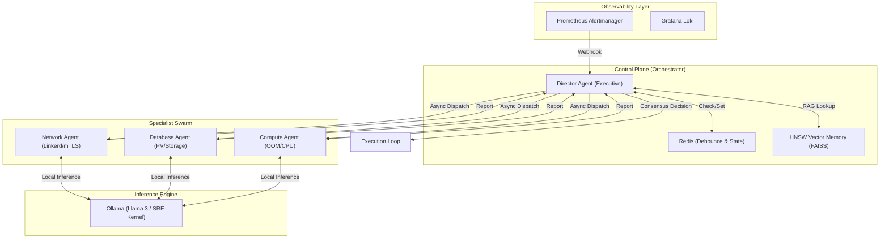
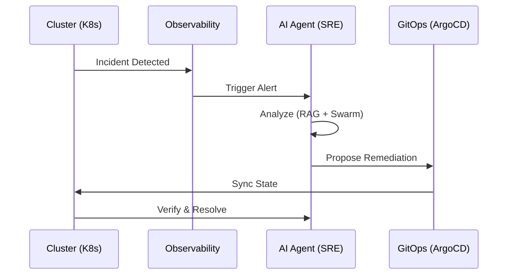

# 🤖 AI4ALL-SRE: The Autonomous Engineering Laboratory
> **Tier-1 Technical Documentation: v4.2.0**

[](https://google.github.io/sre/)
[](https://www.devsecops.org/)
[](https://ollama.com/)
[](LICENSE)

AI4ALL-SRE is an enterprise-grade laboratory and **Internal Developer Platform (IDP)** for researching the intersection of SRE, DevSecOps, and Autonomous AI Agents.

### 🆕 New in v5.0.0
- **🧠 Contextual Memory**: HNSW-indexed vector memory for historical incident RAG.
- **🚀 Dynamic Scaling**: Just-in-time node provisioning via Karpenter integration.
- **🛡️ Enhanced VDP**: Standardized security disclosure program (RFC 9116).

---

---

## 🏗️ Architecture & Philosophy

The system is built on a **Zero-Trust Data Mesh** and an **Autonomous Multi-Agent System (MAS)** that dispatches specialized "SRE Kernels" for domain-specific incident analysis.

### 🐝 The Specialist Swarm (High-Tech)
> **Lead SRE Perspective**: This is a non-linear, event-driven orchestration layer. It utilizes **Asynchronous Message Passing** and **Vectorized Context Injection (RAG)** to provide "Context-Aware" reasoning at the edge. The Swarm uses a **Consensus Mechanism** where the Director Agent acts as the *Raft* leader for operational decisions.


```mermaid
graph TB
    subgraph "Observability Layer"
        ALM["Prometheus Alertmanager"]
        LOKI["Grafana Loki"]
    end

    subgraph "Control Plane (Orchestrator)"
        DIR["Director Agent (Executive)"]
        RED["Redis (Debounce & State)"]
        FAISS["HNSW Vector Memory (FAISS)"]
    end

    subgraph "Specialist Swarm"
        NET["Network Agent (Linkerd/mTLS)"]
        DB["Database Agent (PV/Storage)"]
        COMP["Compute Agent (OOM/CPU)"]
    end

    subgraph "Inference Engine"
        OLL["Ollama (Llama 3 / SRE-Kernel)"]
    end

    ALM -->|Webhook| DIR
    DIR <-->|Check/Set| RED
    DIR -->|Async Dispatch| NET & DB & COMP
    NET & DB & COMP <-->|Local Inference| OLL
    DIR <-->|RAG Lookup| FAISS
    NET & DB & COMP -->|Report| DIR
    DIR -->|Consensus Decision| EXEC["Execution Loop"]
```

> **Simple Explanation**: Think of this as a team of expert robot doctors. When the cluster gets "sick" (an alert), the Director Robot (the surgeon) calls in specialists (Network, Database, Compute). They look at the patient's history (Vector Memory) and local charts (Observability) to decide together how to fix the problem without asking for a human's help.

### 🔄 The Autonomous Loop (Simplified)
> **Lead SRE Perspective**: A closed-loop control system utilizing **GitOps as the Source of Truth**. By enforcing **Desired State vs. Actual State** reconciliation via ArgoCD, we ensure that the AI Agent's remediations are idempotent, auditable, and reversible.


```mermaid
sequenceDiagram
    participant C as Cluster (K8s)
    participant O as Observability
    participant A as AI Agent (SRE)
    participant G as GitOps (ArgoCD)

    C->>O: Incident Detected
    O->>A: Trigger Alert
    A->>A: Analyze (RAG + Swarm)
    A->>G: Propose Remediation
    G->>C: Sync State
    C->>A: Verify & Resolve
```

> **Simple Explanation**: It's like a smart thermostat for your software. 1. It sees the temperature change (Incident). 2. It checks what the temperature *should* be (GitOps). 3. It turns on the AC (Remediation). 4. It checks again to make sure everything is okay.

For a deeper dive into these patterns, see the [Full System Architecture](docs/reference/ARCHITECTURE.md).

- **Local-First AI**: Specialized "SRE-Kernels" running on local GPUs via Ollama.
- **Zero-Trust Mesh**: mTLS and Authorization at every hop via Linkerd.
- **GitOps Core**: Infrastructure and application state managed via Terraform and ArgoCD.
- **Autonomous Loop**: A feedback-driven system that Detects, Analyzes, and Remediates in < 120s.

---

## 📂 Documentation Structure (Diátaxis Alignment)

Our documentation hub is designed for professional engineering onboarding.

| Category | Description | Key Documents |
| :--- | :--- | :--- |
| **🚀 Tutorials** | Guided onboarding for new engineers. | [Quickstart Guide](docs/tutorials/01-quickstart.md) |
| **🛠️ How-To** | Practical SOPs for operational tasks. | [Disaster Recovery](docs/how-to/disaster-recovery-dry-runs.md), [Remote State Migration](docs/how-to/remote-state-migration.md) |
| **🏗️ Reference** | Technical specifications and C4 models. | [System Architecture](docs/reference/system-architecture.md) |
| **🧠 Explanation** | Deep-dives into our engineering philosophy. | [Platform Manifesto](docs/explanation/platform-engineering-manifesto.md) |

---

## ⚡ Quickstart: The Golden Path

```bash
# 1. Initialize the Hardware & Cluster Plane
make setup

# 2. Deploy the AI SRE Agent
npx -y pm2 start ai_agent.py --interpreter python3

# 3. Trigger a Chaos Experiment
kubectl apply -f chaos/network-delay.yaml
```

---

## 🧪 Operational Validation & Testing

The platform maintains a high standard of reliability through an extensive unit and integration testing suite.

```bash
# Provide a 100% reproducible zero-to-hero lifecycle (Destroy -> Setup -> Verify)
make test-lifecycle

# Run the comprehensive A-to-Z End-to-End Test Suite against live endpoints
make test-e2e

# Run specialized Python unit tests
python3 -m unittest discover tests/
```

- **Lifecycle reproducibility**: `lifecycle_test.sh` proves that the entire infrastructure and data mesh can be fully destroyed and rebuilt from scratch and validated autonomously.
- **Specialized AI Tests**: Validates MAS Consensus, Safety Guardrails, and Remediation Edge Cases.
- **Infrastructure Validation**: Terraform linting and security scanning (Trivy/TFSec).
- **Operational Scripts**: Unit tests for GoAlert configuration, cert generation, and load generators.

---

## 🛡️ Security & Compliance

The laboratory implements strict **Governance-as-Code**:
- **Kyverno**: Admission gaurdrails blocking CVE-exposed images.
- **Linkerd**: Mandatory mTLS for all machine-to-machine traffic.
- **CodeQL**: Automated security scanning of the autonomous agent logic.

---

## 👥 Meet the Specialist Swarm

The **Autonomous MAS** consists of specialized agents that collaborate on incident resolution:
- 🌐 **Network Specialist**: Linkerd/Traffic Analysis.
- 💾 **Database Specialist**: State & Storage Integrity.
- ⚙️ **Compute Specialist**: CPU/Memory profiling.
- 🎬 **Director Agent**: Consensus and Execution Engine.

---

## 🛠️ The Global Stack & Methodologies (Fortune 500 Standards)

The AI4ALL-SRE platform is built on the shoulders of giants. Below is a detailed map of the core technologies, methodologies, and best practices that power this Autonomous Engineering Laboratory.

### 🏗️ Infrastructure & Orchestration
- **[K8s (Kubernetes)](https://kubernetes.io/)**: Orchestration for automated deployment, scaling, and management of containerized applications.
- **[IaC (Infrastructure as Code) - Terraform](https://www.terraform.io/)**: Tool for building, changing, and versioning infrastructure safely.
- **[GitOps (Git Operations)](https://www.gitops.tech/)**: Operational framework for managing infrastructure and applications via Git.
- **[IDP (Internal Developer Platform)](https://internaldeveloperplatform.org/)**: Self-service layer for developers to manage their applications.
- **[ArgoCD (Argo Continuous Delivery)](https://argoproj.github.io/cd/)**: Declarative, GitOps continuous delivery for Kubernetes.
- **[Karpenter](https://karpenter.sh/)**: Just-in-time node provisioning for Kubernetes clusters.
- **[Helm (Kubernetes Package Manager)](https://helm.sh/)**: Standard for defining and installing K8s applications.
- **[KinD (Kubernetes in Docker)](https://kind.sigs.k8s.io/)**: Tool for running local Kubernetes clusters.

### 🛡️ Security & Compliance (DevSecOps)
- **[VDP (Vulnerability Disclosure Program)](https://www.cisa.gov/vulnerability-disclosure-policy-vdp)**: Structured way to receive security vulnerabilities from the public.
- **[SLSA (Supply-chain Levels for Software Artifacts)](https://slsa.dev/)**: Security framework to improve supply chain integrity.
- **[ZTA (Zero-Trust Architecture)](https://www.nist.gov/publications/zero-trust-architecture)**: Security model requiring continuous validation of every user and device.
- **[mTLS (Mutual Transport Layer Security)](https://www.cloudflare.com/learning/access-management/what-is-mutual-tls/)**: Mutual verification of certificates between client and server.
- **[PaC (Policy as Code / Kyverno)](https://kyverno.io/)**: Native Kubernetes policy engine for admission control.
- **[Cosign (Sigstore)](https://github.com/sigstore/cosign)**: Standard for signing and verifying OCI container images.
- **[SAST (Static Application Security Testing) - CodeQL](https://codeql.github.com/)**: Semantic code analysis engine for vulnerability discovery.
- **[Trivy](https://trivy.dev/)**: Comprehensive scanner for vulnerabilities, misconfigurations, and secrets.
- **[Gitleaks](https://github.com/gitleaks/gitleaks)**: Tool for detecting and preventing hardcoded secrets.
- **[Vault (HashiCorp Vault)](https://www.vaultproject.io/)**: Secure secrets management and encryption.
- **[Linkerd (Service Mesh)](https://linkerd.io/)**: Ultra-light, security-first service mesh for Kubernetes.

### 🧠 AI / ML / LLM Engineering (AIOps)
- **[Ollama](https://ollama.com/)**: Local LLM execution engine for data sovereignty.
- **[LLM (Large Language Model) - Llama 3](https://llama.meta.com/)**: Foundation model used for SRE-Kernel reasoning.
- **[HNSW (Hierarchical Navigable Small Worlds)](https://arxiv.org/abs/1603.09320)**: Algorithm for efficient Approximate Nearest Neighbor (ANN) search.
- **[MAS (Multi-Agent System)](https://en.wikipedia.org/wiki/Multi-agent_system)**: Interaction of multiple intelligent specialist agents.
- **[RAG (Retrieval-Augmented Generation)](https://aws.amazon.com/what-is/retrieval-augmented-generation/)**: Technique to ground LLM responses in external context.
- **[MLOps (Machine Learning Operations)](https://en.wikipedia.org/wiki/MLOps)**: Practices for deploying and maintaining ML models reliably.

### 📊 Observability & SRE (Site Reliability Engineering)
- **[SRE (Site Reliability Engineering)](https://sre.google/)**: Discipline combining software and systems engineering for high reliability.
- **[OTel (OpenTelemetry)](https://opentelemetry.io/)**: Framework for collecting metrics, logs, and traces.
- **[eBPF (Extended Berkeley Packet Filter)](https://ebpf.io/)**: Kernel-level technology for high-performance networking and observability.
- **[SLO/SLI/SLA (Service Level Objectives/Indicators/Agreements)](https://sre.google/sre-book/service-level-objectives/)**: Frameworks for measuring service reliability.
- **[Chaos Engineering (Chaos Mesh)](https://chaos-mesh.org/)**: Disciplined testing of system resilience via fault injection.
- **[Prometheus (Monitoring/Alerting)](https://prometheus.io/)**: Open-source systems monitoring and alerting toolkit.
- **[RCA (Root Cause Analysis)](https://en.wikipedia.org/wiki/Root_cause_analysis)**: Method of problem solving used for identifying the root causes of faults.

### ⚙️ CI/CD & Documentation
- **[CI/CD (Continuous Integration / Continuous Delivery)](https://en.wikipedia.org/wiki/CI/CD)**: Automation to combine and deliver software updates.
- **[GA (GitHub Actions)](https://github.com/features/actions)**: Built-in CI/CD for GitHub repositories.
- **[Pre-commit](https://pre-commit.com/)**: Multi-language framework for pre-commit hooks.
- **[Vale](https://vale.sh/)**: Syntax-aware linter for technical documentation.
- **[Diátaxis](https://diataxis.fr/)**: Systematic framework for documentation authoring.

---

---
*Engineering Lead: AI4ALL-SRE Platform*
