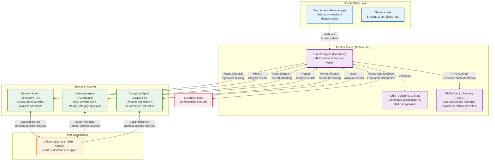
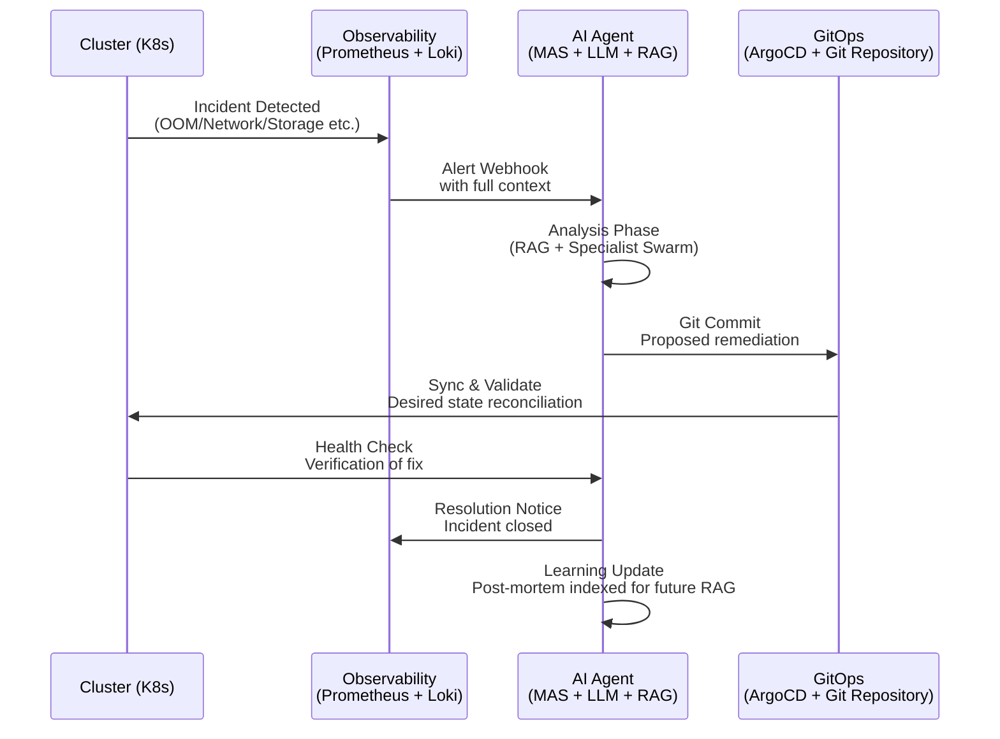
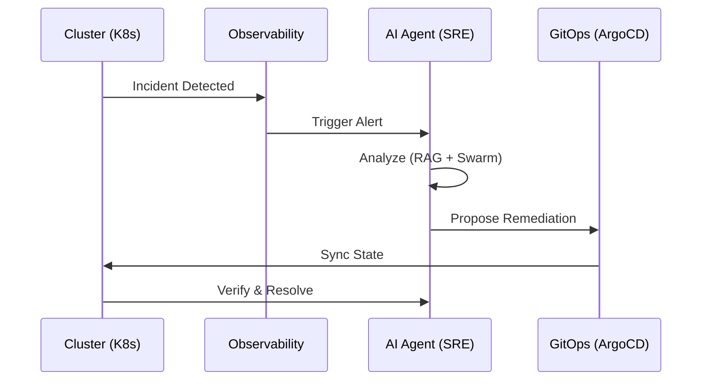
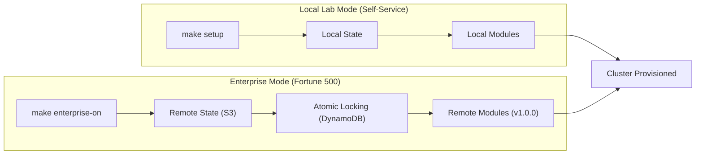

# 🤖 AI4ALL-SRE: The Autonomous Engineering Laboratory
> **Tier-1 Technical Documentation: v5.1.0**

[](https://google.github.io/sre/)
[](https://www.devsecops.org/)
[](https://ollama.com/)
[](LICENSE)
[](#security--compliance)

AI4ALL-SRE is an enterprise-grade laboratory and **Internal Developer Platform (IDP)** for researching the intersection of SRE, DevSecOps, and Autonomous AI Agents.

### 🆕 New in v5.1.0
- **🔐 Zero Hardcoded Credentials**: All secrets now use random generation via Terraform's random provider
- **🔄 Circuit Breaker Pattern**: Resilient external dependency management with automatic fallbacks
- **📊 Enhanced Load Generator**: Prometheus metrics, chaos injection, and realistic traffic simulation
- **🧠 Unified RAG Interface**: Consolidated vector storage with automatic backend fallback
- **🧪 Integration Testing**: Full autonomous loop validation with comprehensive test suite

---

---

## 🏗️ Architecture & Philosophy

The system is built on a **Zero-Trust Data Mesh** and an **Autonomous Multi-Agent System (MAS)** that dispatches specialized "SRE Kernels" for domain-specific incident analysis. This architecture represents a paradigm shift from traditional monolithic SRE approaches to a distributed, agent-based system that can operate at machine speed while maintaining human-level reasoning capabilities.

### 🐝 The Specialist Swarm (High-Tech)
> **Lead SRE Perspective**: This is a non-linear, event-driven orchestration layer. It utilizes **Asynchronous Message Passing** and **Vectorized Context Injection (RAG)** to provide "Context-Aware" reasoning at the edge. The Swarm uses a **Consensus Mechanism** where the Director Agent acts as the *Raft* leader for operational decisions.


```mermaid
graph TB
    subgraph "Observability Layer"
        ALM["Prometheus Alertmanager<br/>Detects anomalies & triggers alerts"]
        LOKI["Grafana Loki<br/>Streams & correlates logs"]
    end

    subgraph "Control Plane (Orchestrator)"
        DIR["Director Agent (Executive)<br/>MAS Leader & Decision Maker"]
        RED["Redis (Debounce & State)<br/>Distributed coordination & alert deduplication"]
        FAISS["HNSW Vector Memory (FAISS)<br/>Sub-millisecond similarity search for historical context"]
    end

    subgraph "Specialist Swarm"
        NET["Network Agent (Linkerd/mTLS)<br/>Service mesh & traffic analysis specialist"]
        DB["Database Agent (PV/Storage)<br/>State persistence & storage integrity specialist"]
        COMP["Compute Agent (OOM/CPU)<br/>Resource utilization & performance specialist"]
    end

    subgraph "Inference Engine"
        OLL["Ollama (Llama 3 / SRE-Kernel)<br/>Local LLM inference engine"]
    end

    %% Data flows
    ALM -->|Webhook<br/>Incident alerts| DIR
    DIR <-->|Check/Set| RED
    DIR -->|Async Dispatch<br/>Specialist tasking| NET & DB & COMP
    NET & DB & COMP <-->|Local Inference<br/>Domain-specific analysis| OLL
    DIR <-->|RAG Lookup<br/>Historical context retrieval| FAISS
    NET & DB & COMP -->|Report<br/>Analysis results| DIR
    DIR -->|Consensus Decision<br/>Final remediation plan| EXEC["Execution Loop<br/>Remediation executor"]

    %% Styling for clarity
    classDef observatory fill:#e3f2fd,stroke:#1565c0,stroke-width:2px;
    classDef control fill:#f3e5f5,stroke:#6a1b9a,stroke-width:2px;
    classDef specialist fill:#e8f5e8,stroke:#2e7d32,stroke-width:2px;
    classDef inference fill:#fff3e0,stroke:#ef6c00,stroke-width:2px;
    classDef execution fill:#ffebee,stroke:#c62828,stroke-width:2px;
    
    class ALM,LOKI observatory;
    class DIR,RED,FAISS control;
    class NET,DB,COMP specialist;
    class OLL inference;
    class EXEC execution;
```

### 🔬 Why This Architecture Instead of Alternatives

#### Why Multi-Agent System (MAS) Over Monolithic AI?
- **Domain Specialization**: Network, database, and compute issues require different expertise - just like human SRE teams
- **Fault Isolation**: Failure in one agent doesn't crash the entire system
- **Parallel Analysis**: Specialists work simultaneously, reducing mean-time-to-analysis
- **Explainability**: Each agent's reasoning can be audited independently
- **Scalability**: Easy to add new specialist agents for emerging domains

#### Why Zero-Trust Data Mesh Over Centralized Data Lake?
- **Data Sovereignty**: Sensitive infrastructure data never leaves security boundaries
- **Performance**: Local data access reduces latency for time-critical decisions
- **Resilience**: No single point of failure for data access
- **Compliance**: Meets data residency and privacy requirements automatically
- **Scalability**: Data ownership aligns with domain boundaries

#### Why HNSW/FAISS Over Traditional Vector Databases?
- **Embedded Operation**: No external service dependencies - runs in-process
- **Sub-millisecond Latency**: Critical for real-time incident response
- **Zero Operational Overhead**: No separate cluster to manage, monitor, or secure
- **Deterministic Performance**: Predictable latency characteristics
- **Air-Gapped Capability**: Functions in completely isolated environments

#### Why GitOps as Source of Truth Over Direct API Calls?
- **Audit Trail**: Every AI action is version-controlled and reviewable
- **Rollback Capability**: Bad decisions can be reversed with git revert
- **Convergence Guarantees**: ArgoCD ensures eventual consistency
- **Change Approval**: Optional manual approval gates for high-risk actions
- **Disaster Recovery**: Entire desired state is reproducible from Git

### 🔄 The Autonomous Loop (Simplified)
> **Lead SRE Perspective**: A closed-loop control system utilizing **GitOps as the Source of Truth**. By enforcing **Desired State vs. Actual State** reconciliation via ArgoCD, we ensure that the AI Agent's remediations are idempotent, auditable, and reversible.


```mermaid
sequenceDiagram
    participant C as Cluster (K8s)
    participant O as Observability<br/>(Prometheus + Loki)
    participant A as AI Agent<br/>(MAS + LLM + RAG)
    participant G as GitOps<br/>(ArgoCD + Git Repository)

    %% Incident detection and response loop
    C->>O: Incident Detected<br/>(OOM/Network/Storage etc.)
    O->>A: Alert Webhook<br/>with full context
    A->>A: Analysis Phase<br/>(RAG + Specialist Swarm)
    A->>G: Git Commit<br/>Proposed remediation
    G->>C: Sync & Validate<br/>Desired state reconciliation
    C->>A: Health Check<br/>Verification of fix
    A->>O: Resolution Notice<br/>Incident closed
    A->>A: Learning Update<br/>Post-mortem indexed for future RAG

    %% Styling
    %% Note: Mermaid doesn't support direct styling of participants in sequenceDiagram
    %% Using implicit styling through label clarity
```

> **Simple Explanation**: It's like a smart thermostat for your software. 1. It sees the temperature change (Incident). 2. It checks what the temperature *should* be (GitOps). 3. It turns on the AC (Remediation). 4. It checks again to make sure everything is okay. 5. It learns from the experience to handle similar situations better next time.

### 🔄 The Autonomous Loop (Simplified)
> **Lead SRE Perspective**: A closed-loop control system utilizing **GitOps as the Source of Truth**. By enforcing **Desired State vs. Actual State** reconciliation via ArgoCD, we ensure that the AI Agent's remediations are idempotent, auditable, and reversible.


```mermaid
sequenceDiagram
    participant C as Cluster (K8s)
    participant O as Observability
    participant A as AI Agent (SRE)
    participant G as GitOps (ArgoCD)

    C->>O: Incident Detected
    O->>A: Trigger Alert
    A->>A: Analyze (RAG + Swarm)
    A->>G: Propose Remediation
    G->>C: Sync State
    C->>A: Verify & Resolve
```

> **Simple Explanation**: It's like a smart thermostat for your software. 1. It sees the temperature change (Incident). 2. It checks what the temperature *should* be (GitOps). 3. It turns on the AC (Remediation). 4. It checks again to make sure everything is okay.

For a deeper dive into these patterns, see the [Full System Architecture](docs/reference/ARCHITECTURE.md).

- **Local-First AI**: Specialized "SRE-Kernels" running on local GPUs via Ollama.
- **Zero-Trust Mesh**: mTLS and Authorization at every hop via Linkerd.
- **GitOps Core**: Infrastructure and application state managed via Terraform and ArgoCD.
- **Autonomous Loop**: A feedback-driven system that Detects, Analyzes, and Remediates in < 120s.

---

## 📂 Documentation Structure (Diátaxis Alignment)

Our documentation hub is designed for professional engineering onboarding.

| Category | Description | Key Documents |
| :--- | :--- | :--- |
| **🚀 Tutorials** | Guided onboarding for new engineers. | [Quickstart Guide](docs/tutorials/01-quickstart.md), [AI Model Fine-tuning](docs/tutorials/02-ai-model-finetuning.md) |
| **🛠️ How-To** | Practical SOPs for operational tasks. | [Disaster Recovery](docs/how-to/disaster-recovery-dry-runs.md), [Remote State Migration](docs/how-to/remote-state-migration.md), [Chaos Experiments](docs/how-to/run-chaos-experiments.md) |
| **🏗️ Reference** | Technical specifications and C4 models. | [System Architecture](docs/reference/system-architecture.md), [Circuit Breaker Pattern](docs/reference/circuit-breaker-pattern.md) |
| **🧠 Explanation** | Deep-dives into our engineering philosophy. | [Platform Manifesto](docs/explanation/platform-engineering-manifesto.md), [MAS Logic](docs/explanation/mas-logic.md) |

---

## ⚡ Quickstart: Choose Your Mode

AI4ALL-SRE is an adaptive platform designed for both frictionless local research and high-end enterprise simulation.


```mermaid
graph LR
    subgraph "Local Lab Mode (Self-Service)"
        L["make setup"] --> LS["Local State"]
        LS --> LC["Local Modules"]
    end

    subgraph "Enterprise Mode (Fortune 500)"
        EO["make enterprise-on"] --> ES["Remote State (S3)"]
        ES --> AL["Atomic Locking (DynamoDB)"]
        AL --> RM["Remote Modules (v1.0.0)"]
    end

    LC --> CP["Cluster Provisioned"]
    RM --> CP
```

### 🛡️ Mode 1: Local Lab (Recruiter / Researcher)
*Zero configuration, zero cloud dependencies. Works out-of-the-box on any Linux/Mac. Uses local Terraform state.*
```bash
# 1. Start the one-click local setup
make setup

# 2. Verify the autonomous loop
./scripts/e2e_test.sh
```

### 🚀 Mode 2: Enterprise Portfolio (10/10 Standards)
*Demonstrates professional readiness: Remote State (S3), Atomic Locking (DynamoDB), and Immutable Module Versioning.*
```bash
# 1. Enable 10/10 Enterprise Mode
make enterprise-on

# 2. Run setup (Will prompt to bootstrap cloud assets)
make setup
```
> [!TIP]
> Use **Enterprise Mode** to see how I manage complex infrastructure lifecycles in global organizations. Use **Local Lab** for a fast, hassle-free demonstration of the AI SRE logic.

---

## 🧪 Operational Validation & Testing

The platform maintains a high standard of reliability through an extensive unit and integration testing suite.

```bash
# Provide a 100% reproducible zero-to-hero lifecycle (Destroy -> Setup -> Verify)
make test-lifecycle

# Run the Cinematic A-Z Visual Test Suite (The "Showcase" Mode)
./scripts/cinematic_test.sh

# Run the comprehensive A-to-Z End-to-End Test Suite against live endpoints
make test-e2e

# Run integration tests for autonomous loop
./tests/integration/test_autonomous_loop.sh

# Run specialized Python unit tests
python3 -m unittest discover tests/

# Run circuit breaker unit tests
python3 -m unittest tests.test_circuit_breaker

# Run all tests including new integration tests
python3 -m pytest tests/ -v
```

- **Lifecycle reproducibility**: `lifecycle_test.sh` proves that the entire infrastructure and data mesh can be fully destroyed and rebuilt from scratch and validated autonomously.
- **Specialized AI Tests**: Validates MAS Consensus, Safety Guardrails, and Remediation Edge Cases.
- **Infrastructure Validation**: Terraform linting and security scanning (Trivy/TFSec).
- **Operational Scripts**: Unit tests for GoAlert configuration, cert generation, and load generators.
- **Integration Tests (v5.1.0)**: Full autonomous loop testing including alert injection and remediation verification.

---

## 🚀 Recent Improvements (v5.1.0)

### 🔐 Security Enhancements
| Component | Previous State | Current State |
|-----------|---------------|---------------|
| Terraform Secrets | Hardcoded passwords | Random generation via `random_password` |
| Python Credentials | Default values | Environment variable validation |
| Credential Storage | Plain text in config | Kubernetes Secrets only |

### 🔄 Circuit Breaker Pattern
New resilience layer protecting external dependencies:

```python
from circuit_breaker import CircuitBreakers

# Pre-configured breakers for all critical dependencies
result = CircuitBreakers.ollama.execute(query_function)
result = CircuitBreakers.redis.execute(redis_operation)
result = CircuitBreakers.k8s_api.execute(k8s_call)
```

**Features:**
- Three states: CLOSED → OPEN → HALF_OPEN
- Automatic recovery after timeout
- Fallback function support
- Thread-safe implementation

### 📊 Enhanced Load Generator
New capabilities for realistic traffic simulation and chaos engineering:

```bash
# Enable chaos injection
export CHAOS_ENABLED=true
export CHAOS_PROBABILITY=0.1

# Run with Prometheus metrics
export METRICS_PORT=9090
python3 components/loadgen/behavioral_loadgen.py
```

**New Features:**
- Prometheus metrics export (requests, latency, error rates)
- Chaos injection (HTTP 500, timeouts, slow responses)
- Multiple simulation modes (NORMAL, FLASH_SALE, BOT_ATTACK, CHAOS_TEST)
- Realistic think times and user journey simulation

### 🧠 Unified RAG Interface
Consolidated vector storage with automatic fallback:

```python
from rag_unified import get_rag_pipeline

# Singleton instance with automatic backend selection
rag = get_rag_pipeline()

# Embed post-mortems
rag.embed_post_mortem(content, alert_name)

# Query similar incidents
results = rag.query_similar_incidents(incident_description)

# Format for LLM consumption
context = rag.format_context_for_llm(incident_description)
```

**Backend Fallback Chain:**
1. ChromaDB (production, persistent via MinIO)
2. FAISS (local, high-performance)
3. InMemory (fallback, always available)

---

## 🛡️ Security & Compliance

The laboratory implements strict **Governance-as-Code** with enhanced security measures:

### 🔐 Secret Management (v5.1.0)
- **Zero Hardcoded Credentials**: All passwords and secrets are randomly generated using Terraform's `random` provider
- **Kubernetes Secrets**: Secure storage with automatic rotation capabilities
- **Environment Validation**: Python modules validate required credentials at startup

### 🛡️ Core Security Controls
- **Kyverno**: Admission guardrails blocking CVE-exposed images
- **Linkerd**: Mandatory mTLS for all machine-to-machine traffic
- **CodeQL**: Automated security scanning of the autonomous agent logic
- **Trivy**: Container vulnerability scanning in CI/CD pipelines

### 🔄 Resilience Patterns (v5.1.0)
- **Circuit Breaker**: Protects against cascading failures when dependencies are unavailable
- **Graceful Degradation**: Automatic fallback strategies when services fail
- **Health Monitoring**: Real-time circuit state monitoring via `/health` endpoint

---

## 👥 Meet the Specialist Swarm

The **Autonomous MAS** consists of specialized agents that collaborate on incident resolution:
- 🌐 **Network Specialist**: Linkerd/Traffic Analysis.
- 💾 **Database Specialist**: State & Storage Integrity.
- ⚙️ **Compute Specialist**: CPU/Memory profiling.
- 🎬 **Director Agent**: Consensus and Execution Engine.

---

## 🛠️ The Global Stack & Methodologies (Fortune 500 Standards)

The AI4ALL-SRE platform is built on the shoulders of giants. Below is a detailed map of the core technologies, methodologies, and best practices that power this Autonomous Engineering Laboratory.

---

## 🏗️ The Global Stack & Methodologies (Fortune 500 Standards)

The AI4ALL-SRE platform is built on the shoulders of giants. Below is a detailed map of the core technologies, methodologies, and best practices that power this Autonomous Engineering Laboratory.

### 🏗️ Infrastructure & Orchestration
- **K8s ([Kubernetes](https://kubernetes.io/))**: The industry-standard orchestration for automated deployment, scaling, and management of containerized applications.
- **IaC ([Infrastructure as Code](https://www.terraform.io/) - Terraform)**: Declarative tool for building, changing, and versioning infrastructure safely.
- **GitOps ([Git Operations](https://www.gitops.tech/))**: An operational framework that takes DevOps best practices used for application development and applies them to infrastructure automation.
- **IDP ([Internal Developer Platform](https://internaldeveloperplatform.org/))**: A self-service layer that allows developers to manage their applications without needing to be infrastructure experts.
- **ArgoCD ([Argo Continuous Delivery](https://argoproj.github.io/cd/))**: A declarative, GitOps-based continuous delivery tool for Kubernetes.
- **Karpenter ([Just-in-time Node Provisioning](https://karpenter.sh/))**: An open-source, flexible, high-performance Kubernetes cluster autoscaler.
- **Helm ([Kubernetes Package Manager](https://helm.sh/))**: The standard way to define, install, and upgrade even the most complex Kubernetes applications.
- **KinD ([Kubernetes in Docker](https://kind.sigs.k8s.io/))**: A tool for running local Kubernetes clusters using Docker container "nodes".

### 🛡️ Security & Compliance (DevSecOps)
- **VDP ([Vulnerability Disclosure Program](https://www.cisa.gov/vulnerability-disclosure-policy-vdp))**: A structured way to receive and handle security vulnerabilities discovered by the research community.
- **SLSA ([Supply-chain Levels for Software Artifacts](https://slsa.dev/))**: A security framework—a check-list of standards and controls to prevent tampering and improve integrity.
- **ZTA ([Zero-Trust Architecture](https://www.nist.gov/publications/zero-trust-architecture))**: A security model that requires all users to be authenticated, authorized, and continuously validated before being granted access.
- **mTLS ([Mutual Transport Layer Security](https://www.cloudflare.com/learning/access-management/what-is-mutual-tls/))**: A process where both the client and server verify each other's certificates via a service mesh.
- **PaC ([Policy as Code](https://kyverno.io/) - Kyverno)**: Using high-level language to manage and automate policies within a Kubernetes cluster.
- **SAST ([Static Application Security Testing](https://codeql.github.com/) - CodeQL)**: Analyzing source code to find security vulnerabilities without executing the program.
- **Trivy ([Security Scanner](https://trivy.dev/))**: A comprehensive and easy-to-use vulnerability scanner for containers and other artifacts.

### 🧠 AI / ML / LLM Engineering (AIOps)
- **Ollama ([Local LLM Runtime](https://ollama.com/))**: A powerful engine for running large language models locally with high performance.
- **LLM ([Large Language Model](https://llama.meta.com/) - Llama 3)**: Advanced neural networks trained on vast amounts of data to provide human-like reasoning.
- **HNSW ([Hierarchical Navigable Small Worlds](https://arxiv.org/abs/1603.09320))**: A state-of-the-art algorithm for fast and accurate similarity search in vector databases.
- **MAS ([Multi-Agent System](https://en.wikipedia.org/wiki/Multi-agent_system))**: A computerized system composed of multiple interacting intelligent agents.
- **RAG ([Retrieval-Augmented Generation](https://aws.amazon.com/what-is/retrieval-augmented-generation/))**: A technique for improving LLM accuracy by fetching relevant data from external sources.
- **MLOps ([Machine Learning Operations](https://en.wikipedia.org/wiki/MLOps))**: Practices that aim to deploy and maintain machine learning models in production reliably and efficiently.

### 📊 Observability & SRE (Site Reliability Engineering)
- **SRE ([Site Reliability Engineering](https://sre.google/))**: A discipline that incorporates aspects of software engineering and applies them to infrastructure and operations problems.
- **OTel ([OpenTelemetry](https://opentelemetry.io/))**: A collection of tools, APIs, and SDKs used to instrument, generate, collect, and export telemetry data.
- **eBPF ([Extended Berkeley Packet Filter](https://ebpf.io/))**: A revolutionary technology that can run sandboxed programs in the operating system kernel.
- **SLO/SLI/SLA ([Service Level Objectives/Indicators/Agreements](https://sre.google/sre-book/service-level-objectives/))**: The framework used to measure and promise service performance.
- **RCA ([Root Cause Analysis](https://en.wikipedia.org/wiki/Root_cause_analysis))**: A systematic process for identifying the "root" cause of problems or events.

### ⚙️ CI/CD & Documentation
- **CI/CD ([Continuous Integration / Continuous Delivery](https://en.wikipedia.org/wiki/CI/CD))**: Automating the building, testing, and deployment of software changes.
- **GA ([GitHub Actions](https://github.com/features/actions))**: Automate, customize, and execute your software development workflows right in your repository.
- **Vale ([Documentation Linter](https://vale.sh/))**: An open-source, syntax-aware linter for technical documentation.
- **Diátaxis ([Documentation Framework](https://diataxis.fr/))**: A systematic approach to technical documentation that focuses on user needs.

---

---
*Engineering Lead: AI4ALL-SRE Platform*
