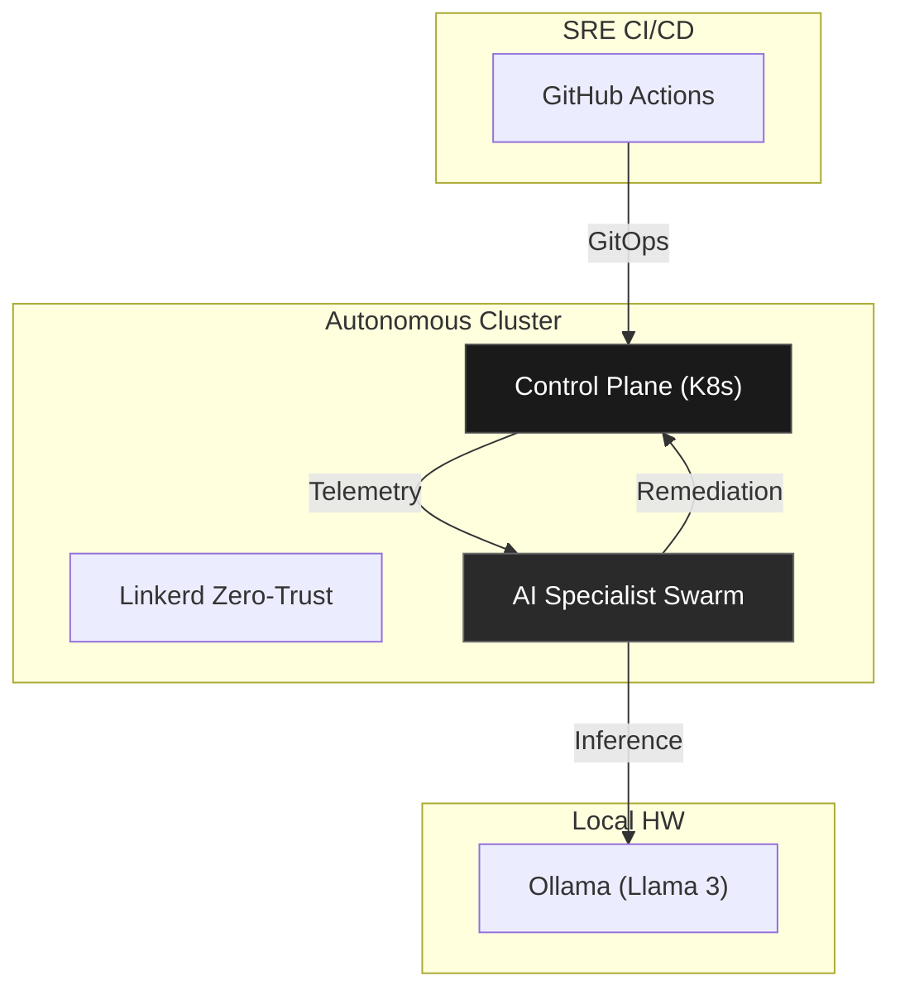

# 🤖 AI4ALL-SRE: The Autonomous Engineering Laboratory
> **Tier-1 Technical Documentation: v4.2.0**

[](https://google.github.io/sre/)
[](https://www.devsecops.org/)
[](https://ollama.com/)
[](LICENSE)

AI4ALL-SRE is an enterprise-grade laboratory and **Internal Developer Platform (IDP)** for researching the intersection of SRE, DevSecOps, and Autonomous AI Agents.

### 🆕 New in v5.0.0
- **🧠 Contextual Memory**: HNSW-indexed vector memory for historical incident RAG.
- **🚀 Dynamic Scaling**: Just-in-time node provisioning via Karpenter integration.
- **🛡️ Enhanced VDP**: Standardized security disclosure program (RFC 9116).

---

## 🏗️ Architecture & Philosophy

The system is built on a **Zero-Trust Data Mesh** and an **Autonomous Multi-Agent System (MAS)**.


```mermaid
graph TD
    subgraph "SRE CI/CD"
        GA["GitHub Actions"]
    end

    subgraph "Autonomous Cluster"
        CP["Control Plane (K8s)"]
        Mesh["Linkerd Zero-Trust"]
        MAS["AI Specialist Swarm"]
    end

    subgraph "Local HW"
        GPU["Ollama (Llama 3)"]
    end

    GA -->|GitOps| CP
    CP -->|Telemetry| MAS
    MAS -->|Inference| GPU
    MAS -->|Remediation| CP
    style CP fill:#1a1a1a,stroke:#4a4a4a,color:#fff
    style MAS fill:#2a2a2a,stroke:#6a6a6a,color:#fff
```

- **Local-First AI**: Specialized "SRE-Kernels" running on local GPUs via Ollama.
- **Zero-Trust Mesh**: mTLS and Authorization at every hop via Linkerd.
- **GitOps Core**: Infrastructure and application state managed via Terraform and ArgoCD.
- **Autonomous Loop**: A feedback-driven system that Detects, Analyzes, and Remediates in < 120s.

---

## 📂 Documentation Structure (Diátaxis Alignment)

Our documentation hub is designed for professional engineering onboarding.

| Category | Description | Key Documents |
| :--- | :--- | :--- |
| **🚀 Tutorials** | Guided onboarding for new engineers. | [Quickstart Guide](docs/tutorials/01-quickstart.md) |
| **🛠️ How-To** | Practical SOPs for operational tasks. | [Disaster Recovery](docs/how-to/disaster-recovery-dry-runs.md) |
| **🏗️ Reference** | Technical specifications and C4 models. | [System Architecture](docs/reference/system-architecture.md) |
| **🧠 Explanation** | Deep-dives into our engineering philosophy. | [Platform Manifesto](docs/explanation/platform-engineering-manifesto.md) |

---

## ⚡ Quickstart: The Golden Path

```bash
# 1. Initialize the Hardware & Cluster Plane
make setup

# 2. Deploy the AI SRE Agent
npx -y pm2 start ai_agent.py --interpreter python3

# 3. Trigger a Chaos Experiment
kubectl apply -f chaos/network-delay.yaml
```

---

## 🧪 Operational Validation & Testing

The platform maintains a high standard of reliability through an extensive unit and integration testing suite.

```bash
# Provide a 100% reproducible zero-to-hero lifecycle (Destroy -> Setup -> Verify)
make test-lifecycle

# Run the comprehensive A-to-Z End-to-End Test Suite against live endpoints
make test-e2e

# Run specialized Python unit tests
python3 -m unittest discover tests/
```

- **Lifecycle reproducibility**: `lifecycle_test.sh` proves that the entire infrastructure and data mesh can be fully destroyed and rebuilt from scratch and validated autonomously.
- **Specialized AI Tests**: Validates MAS Consensus, Safety Guardrails, and Remediation Edge Cases.
- **Infrastructure Validation**: Terraform linting and security scanning (Trivy/TFSec).
- **Operational Scripts**: Unit tests for GoAlert configuration, cert generation, and load generators.

---

## 🛡️ Security & Compliance

The laboratory implements strict **Governance-as-Code**:
- **Kyverno**: Admission gaurdrails blocking CVE-exposed images.
- **Linkerd**: Mandatory mTLS for all machine-to-machine traffic.
- **CodeQL**: Automated security scanning of the autonomous agent logic.

---

## 👥 Meet the Specialist Swarm

The **Autonomous MAS** consists of specialized agents that collaborate on incident resolution:
- 🌐 **Network Specialist**: Linkerd/Traffic Analysis.
- 💾 **Database Specialist**: State & Storage Integrity.
- ⚙️ **Compute Specialist**: CPU/Memory profiling.
- 🎬 **Director Agent**: Consensus and Execution Engine.

---
---

## 🛠️ The Global Stack & Methodologies

The AI4ALL-SRE platform is built on the shoulders of giants. Below is an organized list of the core technologies, methodologies, and best practices that power this Autonomous Engineering Laboratory.

### 🏗️ Infrastructure & Orchestration
- **[K8s (Kubernetes)](https://kubernetes.io/)**: Container orchestration for automated deployment, scaling, and management of containerized applications.
- **[TF (Terraform)](https://www.terraform.io/)**: Infrastructure-as-Code (IaC) tool for building, changing, and versioning infrastructure safely and efficiently.
- **[ArgoCD (Argo Continuous Delivery)](https://argoproj.github.io/cd/)**: A declarative, GitOps continuous delivery tool for Kubernetes.
- **[Karpenter](https://karpenter.sh/)**: Just-in-time, open-source node provisioning for Kubernetes clusters, improving efficiency and cost.
- **[Helm](https://helm.sh/)**: The package manager for Kubernetes, used for defining, installing, and upgrading complex K8s applications.
- **[KinD (Kubernetes in Docker)](https://kind.sigs.k8s.io/)**: A tool for running local Kubernetes clusters using Docker container "nodes".

### 🛡️ Security & Compliance
- **[VDP (Vulnerability Disclosure Program)](https://www.cisa.gov/vulnerability-disclosure-policy-vdp)**: A structured way for organizations to receive and address security vulnerabilities from the public.
- **[SLSA (Supply-chain Levels for Software Artifacts)](https://slsa.dev/)**: A security framework (check-list of standards and controls) to prevent tampering, improve integrity, and secure packages and infrastructure.
- **[Zero-Trust (Zero-Trust Architecture)](https://www.nist.gov/publications/zero-trust-architecture)**: A security model that requires all users, whether in or outside the organization's network, to be authenticated, authorized, and continuously validated.
- **[mTLS (Mutual TLS)](https://www.cloudflare.com/learning/access-management/what-is-mutual-tls/)**: An extension of TLS that requires both the client and the server to verify each other's certificate.
- **[Kyverno](https://kyverno.io/)**: A policy engine designed for Kubernetes, allowing for validation, mutation, and generation of configurations (Policy-as-Code (PaC)).
- **[Cosign](https://github.com/sigstore/cosign)**: Part of the Sigstore project, used for signing and verifying OCI containers.
- **[Trivy](https://trivy.dev/)**: A comprehensive security scanner for containers and other artifacts, detecting vulnerabilities, misconfigurations, and secrets.
- **[CodeQL](https://codeql.github.com/)**: GitHub's code analysis engine used to discover vulnerabilities across a codebase.
- **[Gitleaks](https://github.com/gitleaks/gitleaks)**: A SAST (Static Application Security Testing) tool for detecting and preventing hardcoded secrets like passwords, api keys, and tokens.
- **[Vault (HashiCorp Vault)](https://www.vaultproject.io/)**: A tool for securely accessing secrets such as API keys, passwords, or certificates.
- **[Linkerd](https://linkerd.io/)**: An ultra-light, security-first service mesh for Kubernetes.

### 🧠 AI & MLOps
- **[Ollama](https://ollama.com/)**: An open-source project that allows you to run open-source large language models (LLMs) locally.
- **[HNSW (Hierarchical Navigable Small Worlds)](https://arxiv.org/abs/1603.09320)**: An algorithm for efficient approximate nearest neighbor (ANN) search in high-dimensional spaces.
- **[MAS (Multi-Agent System)](https://en.wikipedia.org/wiki/Multi-agent_system)**: A system composed of multiple interacting intelligent agents, which can be software programs or robots.
- **[RAG (Retrieval-Augmented Generation)](https://aws.amazon.com/what-is/retrieval-augmented-generation/)**: A technique for giving an LLM access to external data to improve the accuracy and relevance of its responses.
- **[MLOps (Machine Learning Operations)](https://en.wikipedia.org/wiki/MLOps)**: A set of practices that aims to deploy and maintain machine learning models in production reliably and efficiently.

### 📊 Observability & Reliability
- **[SRE (Site Reliability Engineering)](https://sre.google/)**: An engineering discipline that combines software and systems engineering to build and run large-scale, distributed, fault-tolerant systems.
- **[OTel (OpenTelemetry)](https://opentelemetry.io/)**: A collection of tools, APIs, and SDKs used to instrument, generate, collect, and export telemetry data (metrics, logs, and traces).
- **[eBPF (Extended Berkeley Packet Filter)](https://ebpf.io/)**: A revolutionary technology that can run sandboxed programs in an operating system kernel, used for high-performance networking, security, and observability.
- **[SLO/SLI/SLA (Service Level Objectives/Indicators/Agreements)](https://sre.google/sre-book/service-level-objectives/)**: Key frameworks for defining, measuring, and reporting on the reliability of a service.
- **[Chaos Mesh](https://chaos-mesh.org/)**: A powerful chaos engineering platform for Kubernetes that helps find weaknesses in system reliability.
- **[Prometheus](https://prometheus.io/)**: An open-source systems monitoring and alerting toolkit.

### ⚙️ CI/CD & Automation
- **[GitOps (Git Operations)](https://www.gitops.tech/)**: An operational framework that takes DevOps best practices used for application development and applies them to infrastructure automation.
- **[GA (GitHub Actions)](https://github.com/features/actions)**: A CI/CD platform that allows you to automate your build, test, and deployment pipeline.
- **[Pre-commit](https://pre-commit.com/)**: A framework for managing and maintaining multi-language pre-commit hooks.
- **[Vale](https://vale.sh/)**: A syntax-aware linter for prose, used for linting documentation.
- **[Diátaxis](https://diataxis.fr/)**: A systematic framework for technical documentation authoring.

---
*Engineering Lead: AI4ALL-SRE Platform*
