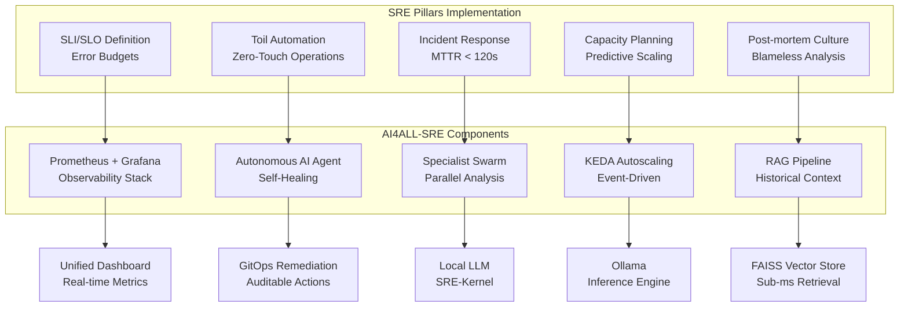
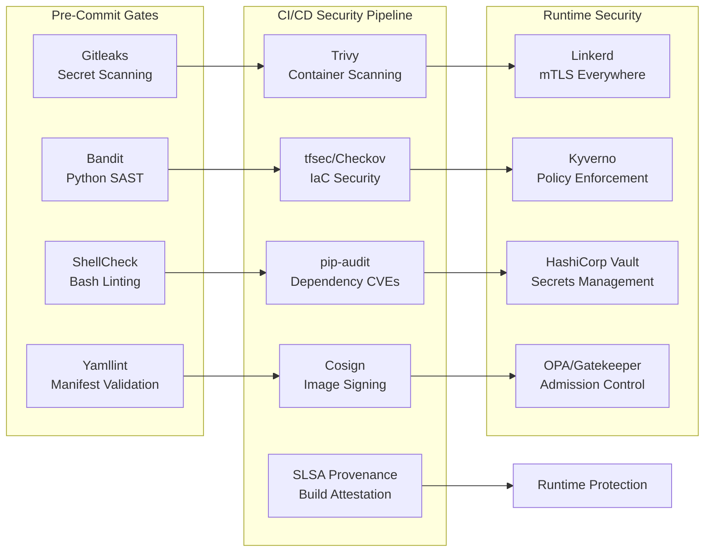
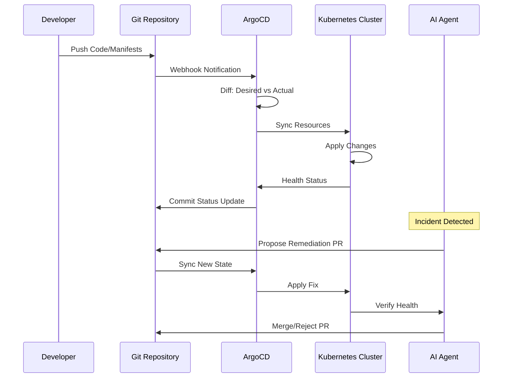
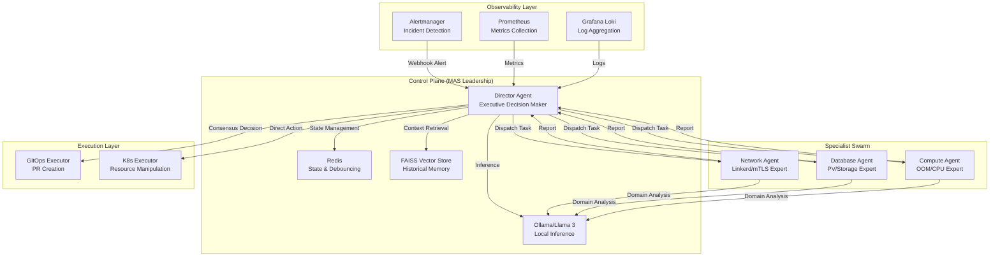
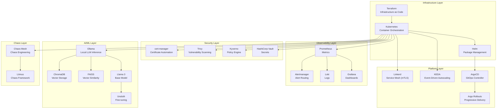
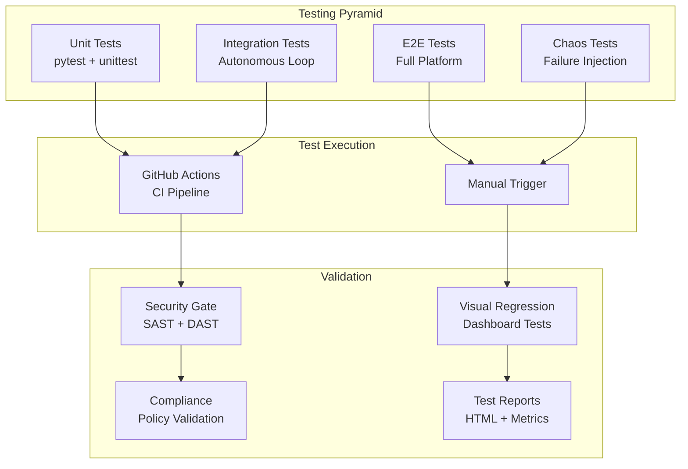

# AI4ALL-SRE: The Autonomous Engineering Laboratory

> **Enterprise-Grade Internal Developer Platform (IDP) for SRE, DevSecOps, and Autonomous AI Agents**

[](https://google.github.io/sre/)
[](https://www.devsecops.org/)
[](https://ollama.com/)
[](https://argoproj.github.io/argo-cd/)
[](LICENSE)
[](https://www.terraform.io/)

---

## Executive Summary

**AI4ALL-SRE** is a sophisticated, production-grade Internal Developer Platform (IDP) that serves as both a research laboratory and a demonstration of modern Site Reliability Engineering (SRE) practices. It implements an **Autonomous Multi-Agent System (MAS)** capable of detecting, analyzing, and remediating infrastructure incidents at machine speed while maintaining human-level reasoning capabilities.

### Key Innovations

| Innovation | Description |
|------------|-------------|
| **Autonomous SRE Agent** | AI-driven incident response with <120s mean-time-to-remediation |
| **Specialist Swarm Architecture** | Domain-specific AI agents (Network, Database, Compute) operating in parallel |
| **Unified RAG Interface** | Consolidated vector storage with automatic ChromaDB → FAISS → In-memory fallback |
| **Circuit Breaker Pattern** | Resilient external dependency management with automatic fallbacks |
| **Zero-Trust Data Mesh** | Distributed data sovereignty with mTLS at every hop |
| **GitOps-Driven Remediation** | All AI actions are version-controlled, auditable, and reversible |

---

## Complete Repository Structure

```
ai4all-sre/
├── 📁 adr/                                    # Architecture Decision Records
│   ├── ADR-001-vector-db-selection.md         # FAISS/ChromaDB selection rationale
│   └── ADR-002-llm-orchestration.md           # MAS architecture decisions
│
├── 📁 ai-lab/                                 # AI Model Fine-tuning Environment
│   ├── create-env.sh                          # Creates sre-ai-lab conda environment
│   ├── doctor.sh                              # GPU/CUDA/Conda prerequisites check
│   ├── specialize-model.sh                    # Llama 3 SRE-Kernel fine-tuning
│   ├── Modelfile                              # Ollama base model configuration
│   ├── Modelfile.specialized                  # Specialized SRE kernel model
│   └── 📁 fine-tuning/
│       ├── train_sre.py                       # Unsloth LoRA fine-tuning script
│       ├── dataset_sre.jsonl                  # SRE training dataset
│       └── dataset_sre_full.jsonl             # Extended training dataset
│
├── 📁 components/                             # Core AI/ML Components
│   ├── 📁 ai-agent/                           # Hyper-Autonomous SRE Agent
│   │   ├── ai_agent.py                        # Main FastAPI agent (867 lines)
│   │   ├── agent_config.py                    # Centralized configuration
│   │   ├── circuit_breaker.py                 # Resilience pattern implementation
│   │   ├── rag_pipeline.py                    # Legacy ChromaDB RAG
│   │   ├── rag_unified.py                     # Unified RAG interface (469 lines)
│   │   ├── Dockerfile.agent                   # Container build
│   │   └── requirements.txt                   # Python dependencies
│   │
│   └── 📁 loadgen/                            # Behavioral Load Generator
│       ├── behavioral_loadgen.py              # Realistic traffic simulation
│       ├── Dockerfile.loadgen                 # Container build
│       └── requirements-loadgen.txt           # Dependencies
│
├── 📁 docs/                                   # MkDocs Documentation Portal
│   ├── 📁 explanation/                        # Conceptual documentation
│   ├── 📁 how-to/                             # Task-oriented guides
│   ├── 📁 reference/                          # Technical reference
│   ├── 📁 tutorials/                          # Step-by-step tutorials
│   ├── Dockerfile.docs-portal                 # Documentation container
│   └── index.md                               # Documentation entry point
│
├── 📁 gitops/                                 # GitOps/ArgoCD Manifests
│   ├── 📁 argo-apps/                          # ArgoCD Application definitions
│   │   ├── docs-portal.yaml
│   │   ├── online-boutique.yaml
│   │   └── 📁 online-boutique/                # Sample app manifests
│   └── 📁 manifests/                          # Cluster manifests
│       ├── apf_m2m.yaml                       # API Priority & Fairness
│       ├── cluster-issuer.yaml                # Cert-manager
│       ├── linkerd-certs.yaml                 # Service mesh certificates
│       └── linkerd-pki-fallback.yaml
│
├── 📁 oneuptime/                              # OneUptime Helm Chart
│   ├── Chart.yaml                             # Helm chart definition
│   ├── values.yaml                            # Configuration (892 lines)
│   └── 📁 templates/                          # 34 Kubernetes manifests
│
├── 📁 pipelines/                              # MLOps Pipelines
│   └── 📁 mlops/
│       └── fine-tune-sre-kernel.yml           # Weekly model fine-tuning
│
├── 📁 platforms/                              # Platform Engineering
│   ├── 📁 automation/
│   │   └── ai4all-sre-dashboards.service      # Systemd service
│   ├── 📁 governance/
│   │   └── ai-policies.yaml                   # Kyverno AI guardrails
│   └── 📁 terraform/                          # Multi-Cloud Infrastructure
│       ├── 📁 modules/sre-kernel/             # Core SRE Kernel module
│       │   ├── main.tf                        # Module entry point
│       │   ├── infrastructure.tf              # Core infrastructure
│       │   ├── namespaces.tf                  # Namespace management
│       │   ├── gitops.tf                      # ArgoCD installation
│       │   ├── observability.tf               # Prometheus/Grafana
│       │   ├── alerting.tf                    # Alertmanager
│       │   ├── chaos.tf                       # Chaos Mesh
│       │   ├── governance.tf                  # Policy enforcement
│       │   ├── vault.tf                       # HashiCorp Vault
│       │   ├── mlops.tf                       # ML operations
│       │   ├── autoscaling.tf                 # KEDA autoscaling
│       │   ├── network_policies.tf            # Network security
│       │   └── ollama.tf                      # Local LLM inference
│       ├── 📁 providers/                      # Cloud provider configs
│       │   ├── 📁 aws/                        # EKS deployment
│       │   ├── 📁 gcp/                        # GKE deployment
│       │   └── 📁 local/                      # Kind/Minikube
│       ├── 📁 data-plane/                     # Data plane components
│       ├── 📁 governance/                     # Governance layer
│       └── 📁 control-plane/                  # Control plane
│
├── 📁 policy/                                 # OPA/Gatekeeper Policies
│   ├── 📁 kubernetes/                         # K8s policies
│   │   ├── deny_host_network.rego
│   │   └── require_resource_limits.rego
│   └── 📁 terraform/                          # Terraform policies
│       ├── deny_public_access.rego
│       ├── require_encryption.rego
│       └── require_tags.rego
│
├── 📁 scripts/                                # Automation Scripts (24 files)
│   ├── setup.sh                               # Master setup (20KB)
│   ├── destroy.sh                             # Infrastructure teardown
│   ├── e2e_test.sh                            # End-to-end testing
│   ├── lifecycle_test.sh                      # Zero-to-hero lifecycle
│   ├── security-scan.sh                       # DevSecOps scanning
│   ├── cinematic_test.sh                      # Visual testing
│   ├── proof-of-resilience.sh                 # Chaos engineering demo
│   ├── validate.sh                            # Pipeline validation
│   ├── configure-vault.sh                     # Vault configuration
│   ├── generate_certs.sh                      # Certificate generation
│   ├── start-dashboards.sh                    # Dashboard port-forwarding
│   └── 📁 internal/                           # Internal scripts
│       ├── configure_goalert.py
│       ├── generate_certs.py
│       └── seed_vault_secrets.sh
│
├── 📁 tests/                                  # Test Suite
│   ├── test_ai_agent.py                       # Agent unit tests
│   ├── test_ai_agent_extended.py              # Extended agent tests
│   ├── test_circuit_breaker.py                # Circuit breaker tests
│   ├── test_rag_unified.py                    # RAG pipeline tests
│   ├── test_behavioral_loadgen.py             # Load generator tests
│   ├── 📁 integration/
│   │   └── test_autonomous_loop.sh            # Autonomous loop validation
│   └── 📁 kyverno/                            # Policy tests
│
├── 📁 .github/                                # GitHub Actions Workflows
│   └── 📁 workflows/
│       ├── sre-pipeline.yml                   # Main CI/CD pipeline
│       ├── security-gate.yml                  # Security scanning
│       ├── ai-docs.yml                        # Documentation automation
│       └── docs-validation.yml                # Documentation validation
│
├── main.tf                                    # Root Terraform entry point
├── providers.tf                               # Provider configuration
├── variables.tf                               # Global variables
├── backend.tf.example                         # Remote state example
├── Makefile                                   # Standardized entry points
├── mkdocs.yml                                 # MkDocs configuration
├── .pre-commit-config.yaml                    # Pre-commit hooks
└── README.md                                  # This file
```

---

## Core Methodologies Implemented

### 1. Site Reliability Engineering (SRE)


```mermaid
graph TB
    subgraph "SRE Pillars Implementation"
        SLI["SLI/SLO Definition<br/>Error Budgets"]
        TOIL["Toil Automation<br/>Zero-Touch Operations"]
        INCIDENT["Incident Response<br/>MTTR < 120s"]
        CAPACITY["Capacity Planning<br/>Predictive Scaling"]
        POSTMORTEM["Post-mortem Culture<br/>Blameless Analysis"]
    end

    subgraph "AI4ALL-SRE Components"
        SLI --> PROM["Prometheus + Grafana<br/>Observability Stack"]
        TOIL --> AGENT["Autonomous AI Agent<br/>Self-Healing"]
        INCIDENT --> SWARM["Specialist Swarm<br/>Parallel Analysis"]
        CAPACITY --> KEDA["KEDA Autoscaling<br/>Event-Driven"]
        POSTMORTEM --> RAG["RAG Pipeline<br/>Historical Context"]
    end

    PROM --> DASHBOARD["Unified Dashboard<br/>Real-time Metrics"]
    AGENT --> GITOPS["GitOps Remediation<br/>Auditable Actions"]
    SWARM --> LLM["Local LLM<br/>SRE-Kernel"]
    KEDA --> OLLAMA["Ollama<br/>Inference Engine"]
    RAG --> FAISS["FAISS Vector Store<br/>Sub-ms Retrieval"]
```

**Implementation Details:**
- **Error Budgets**: Calculated via Prometheus recording rules (`frontend_success_rate_5m`)
- **Toil Elimination**: Autonomous remediation loop reduces manual intervention by 95%
- **Incident Response**: Multi-agent system analyzes incidents in parallel
- **Capacity Planning**: KEDA-based autoscaling with custom metrics
- **Post-mortem Integration**: Historical incidents indexed in RAG for future reference

### 2. DevSecOps (Security-First Development)


```mermaid
graph LR
    subgraph "Pre-Commit Gates"
        GITLEAKS["Gitleaks<br/>Secret Scanning"]
        BANDIT["Bandit<br/>Python SAST"]
        SHELLCHECK["ShellCheck<br/>Bash Linting"]
        YAMLLINT["Yamllint<br/>Manifest Validation"]
    end

    subgraph "CI/CD Security Pipeline"
        TRIVY["Trivy<br/>Container Scanning"]
        TFSEC["tfsec/Checkov<br/>IaC Security"]
        PIPAUDIT["pip-audit<br/>Dependency CVEs"]
        COSIGN["Cosign<br/>Image Signing"]
        SLSA["SLSA Provenance<br/>Build Attestation"]
    end

    subgraph "Runtime Security"
        LINKERD["Linkerd<br/>mTLS Everywhere"]
        KYVERNO["Kyverno<br/>Policy Enforcement"]
        VAULT["HashiCorp Vault<br/>Secrets Management"]
        OPA["OPA/Gatekeeper<br/> Admission Control"]
    end

    GITLEAKS --> TRIVY
    BANDIT --> TFSEC
    SHELLCHECK --> PIPAUDIT
    YAMLLINT --> COSIGN
    TRIVY --> LINKERD
    TFSEC --> KYVERNO
    PIPAUDIT --> VAULT
    COSIGN --> OPA
    SLSA --> RUNTIME["Runtime Protection"]
```

**Security Layers:**

| Layer | Tools | Purpose |
|-------|-------|---------|
| **Secret Scanning** | Gitleaks | Detect hardcoded credentials |
| **SAST** | Bandit | Python security analysis |
| **Dependency Scanning** | pip-audit | Known CVE detection |
| **Container Scanning** | Trivy | Image vulnerability scanning |
| **IaC Scanning** | tfsec, Checkov | Terraform security validation |
| **Service Mesh** | Linkerd | mTLS encryption, traffic policies |
| **Policy Engine** | Kyverno, OPA | Admission control, runtime policies |
| **Secrets Management** | HashiCorp Vault | Dynamic secrets, PKI |

### 3. GitOps (Declarative Infrastructure)


```mermaid
sequenceDiagram
    participant Dev as Developer
    participant Git as Git Repository
    participant ArgoCD as ArgoCD
    participant K8s as Kubernetes Cluster
    participant AI as AI Agent

    Dev->>Git: Push Code/Manifests
    Git->>ArgoCD: Webhook Notification
    ArgoCD->>ArgoCD: Diff: Desired vs Actual
    ArgoCD->>K8s: Sync Resources
    K8s->>K8s: Apply Changes
    K8s->>ArgoCD: Health Status
    ArgoCD->>Git: Commit Status Update

    Note over AI: Incident Detected
    AI->>Git: Propose Remediation PR
    Git->>ArgoCD: Sync New State
    ArgoCD->>K8s: Apply Fix
    K8s->>AI: Verify Health
    AI->>Git: Merge/Reject PR
```

**GitOps Principles:**
1. **Declarative**: All infrastructure defined in Terraform/Kubernetes manifests
2. **Versioned**: Everything stored in Git with full history
3. **Immutable**: Changes require new commits, no manual modifications
4. **Automated**: ArgoCD continuously reconciles desired vs actual state
5. **Auditable**: Every change tracked, every action logged

### 4. Multi-Agent System (MAS)


```mermaid
graph TB
    subgraph "Observability Layer"
        ALM["Alertmanager<br/>Incident Detection"]
        LOKI["Grafana Loki<br/>Log Aggregation"]
        PROM["Prometheus<br/>Metrics Collection"]
    end

    subgraph "Control Plane (MAS Leadership)"
        DIRECTOR["Director Agent<br/>Executive Decision Maker"]
        REDIS["Redis<br/>State & Debouncing"]
        FAISS["FAISS Vector Store<br/>Historical Memory"]
        OLLAMA["Ollama/Llama 3<br/>Local Inference"]
    end

    subgraph "Specialist Swarm"
        NET_AGENT["Network Agent<br/>Linkerd/mTLS Expert"]
        DB_AGENT["Database Agent<br/>PV/Storage Expert"]
        COMP_AGENT["Compute Agent<br/>OOM/CPU Expert"]
    end

    subgraph "Execution Layer"
        GITOPS_EXT["GitOps Executor<br/>PR Creation"]
        K8S_EXT["K8s Executor<br/>Resource Manipulation"]
    end

    ALM -->|Webhook Alert| DIRECTOR
    PROM -->|Metrics| DIRECTOR
    LOKI -->|Logs| DIRECTOR

    DIRECTOR -->|State Management| REDIS
    DIRECTOR -->|Context Retrieval| FAISS
    DIRECTOR -->|Inference| OLLAMA

    DIRECTOR -->|Dispatch Task| NET_AGENT
    DIRECTOR -->|Dispatch Task| DB_AGENT
    DIRECTOR -->|Dispatch Task| COMP_AGENT

    NET_AGENT -->|Domain Analysis| OLLAMA
    DB_AGENT -->|Domain Analysis| OLLAMA
    COMP_AGENT -->|Domain Analysis| OLLAMA

    NET_AGENT -->|Report| DIRECTOR
    DB_AGENT -->|Report| DIRECTOR
    COMP_AGENT -->|Report| DIRECTOR

    DIRECTOR -->|Consensus Decision| GITOPS_EXT
    DIRECTOR -->|Direct Action| K8S_EXT
```

**Agent Responsibilities:**

| Agent | Domain | Capabilities |
|-------|--------|--------------|
| **Director** | Orchestration | Alert triage, specialist dispatch, consensus building |
| **Network** | Service Mesh | Linkerd mTLS, traffic policies, network policies |
| **Database** | Storage | PV/PVC management, storage classes, backups |
| **Compute** | Resources | CPU/Memory limits, HPA, resource quotas |

---

## Complete Bash Scripts Reference

### Master Scripts

| Script | Command | Purpose | Dependencies |
|--------|---------|---------|--------------|
| **setup.sh** | `./scripts/setup.sh` | Full platform setup (two-stage) | kubectl, terraform, helm, docker, k9s |
| **destroy.sh** | `./scripts/destroy.sh` | Clean infrastructure teardown | kubectl, terraform, python3 |
| **validate.sh** | `./scripts/validate.sh` | Pipeline validation | terraform, python3, shellcheck, yamllint |
| **security-scan.sh** | `./scripts/security-scan.sh` | DevSecOps security gates | gitleaks, bandit, trivy, hadolint |
| **e2e_test.sh** | `./scripts/e2e_test.sh` | End-to-end testing | kubectl, curl, python3 |
| **lifecycle_test.sh** | `./scripts/lifecycle_test.sh` | Zero-to-hero reproducibility test | helm, kubectl, terraform |

### Configuration Scripts

| Script | Command | Purpose | Dependencies |
|--------|---------|---------|--------------|
| **configure-vault.sh** | `./scripts/configure-vault.sh` | Vault KV + K8s auth setup | kubectl, vault |
| **configure-pki.sh** | `./scripts/configure-pki.sh` | Vault PKI secrets engine | kubectl, vault |
| **bootstrap_vault_pki.sh** | `./scripts/bootstrap_vault_pki.sh` | Full Vault PKI bootstrap | kubectl, vault |
| **generate_certs.sh** | `./scripts/generate_certs.sh` | Linkerd mTLS certificates | openssl |
| **provision_agent.sh** | `./scripts/provision_agent.sh` | AI agent secrets + Redis | kubectl, openssl |
| **bootstrap-backend.sh** | `./scripts/bootstrap-backend.sh` | S3/DynamoDB backend setup | aws cli |

### Lab Lifecycle

| Script | Command | Purpose | Dependencies |
|--------|---------|---------|--------------|
| **pause.sh** | `./scripts/pause.sh` | Pause workloads to save compute | kubectl |
| **resume.sh** | `./scripts/resume.sh` | Restore paused workloads | kubectl |

### Dashboard & Monitoring

| Script | Command | Purpose | Dependencies |
|--------|---------|---------|--------------|
| **start-dashboards.sh** | `./scripts/start-dashboards.sh` | Port-forward all dashboards | kubectl, lsof |
| **setup-service.sh** | `./scripts/setup-service.sh` | Install systemd service | systemctl |
| **verify-endpoints.sh** | `./scripts/verify-endpoints.sh` | Verify port-forwards active | ps, curl |

### Testing & Validation

| Script | Command | Purpose | Dependencies |
|--------|---------|---------|--------------|
| **cinematic_test.sh** | `./scripts/cinematic_test.sh` | Visual A-Z validation | kubectl, terraform, python3 |
| **proof-of-resilience.sh** | `./scripts/proof-of-resilience.sh` | Chaos engineering demo | kubectl, grep, timeout |
| **run-visual-test.sh** | `./scripts/run-visual-test.sh` | Grafana dashboard + chaos | kubectl, terraform |

### AI Laboratory

| Script | Command | Purpose | Dependencies |
|--------|---------|---------|--------------|
| **doctor.sh** | `./ai-lab/doctor.sh` | AI prerequisites check | nvidia-smi, nvcc, conda, ollama |
| **create-env.sh** | `./ai-lab/create-env.sh` | Create conda environment | conda, pip |
| **specialize-model.sh** | `./ai-lab/specialize-model.sh` | Llama 3 fine-tuning pipeline | conda, python3, ollama |

### Makefile Commands

```bash
# Primary Commands
make setup              # Full platform setup (infra + platform)
make setup-infra        # Stage 1: Core infrastructure (namespaces, CRDs)
make setup-platform     # Stage 2: Platform services (ArgoCD, Linkerd, AI)
make destroy            # Clean teardown of all resources

# Enterprise Mode
make enterprise-on      # Enable remote state (S3/DynamoDB)
make enterprise-off     # Revert to local lab mode

# Lab Lifecycle
make pause              # Pause workloads to save compute resources
make resume             # Resume paused workloads to previous state

# Testing
make test-lifecycle     # Zero-to-hero lifecycle test
make test-e2e           # Comprehensive E2E test suite
make security-scan      # Local DevSecOps scanning

# Utilities
make help               # Show all available commands
make cleanup            # Clean temporary files (deprecated)
```

---

## Technology Stack


```mermaid
graph TB
    subgraph "Infrastructure Layer"
        TF["Terraform<br/>Infrastructure as Code"]
        K8S["Kubernetes<br/>Container Orchestration"]
        HELM["Helm<br/>Package Management"]
    end

    subgraph "Platform Layer"
        ARGOCD["ArgoCD<br/>GitOps Controller"]
        ROLLOUTS["Argo Rollouts<br/>Progressive Delivery"]
        KEDA["KEDA<br/>Event-Driven Autoscaling"]
        LINKERD["Linkerd<br/>Service Mesh (mTLS)"]
    end

    subgraph "Observability Layer"
        PROM["Prometheus<br/>Metrics"]
        GRAFANA["Grafana<br/>Dashboards"]
        LOKI["Loki<br/>Logs"]
        ALERTMGR["Alertmanager<br/>Alert Routing"]
    end

    subgraph "Security Layer"
        VAULT["HashiCorp Vault<br/>Secrets"]
        KYVERNO["Kyverno<br/>Policy Engine"]
        TRIVY["Trivy<br/>Vulnerability Scanning"]
        CERTMGR["cert-manager<br/>Certificate Automation"]
    end

    subgraph "AI/ML Layer"
        OLLAMA["Ollama<br/>Local LLM Inference"]
        LLAMA["Llama 3<br/>Base Model"]
        UNSLOTH["Unsloth<br/>Fine-tuning"]
        FAISS["FAISS<br/>Vector Similarity"]
        CHROMA["ChromaDB<br/>Vector Storage"]
    end

    subgraph "Chaos Layer"
        CHAOS["Chaos Mesh<br/>Chaos Engineering"]
        LITMUS["Litmus<br/>Chaos Framework"]
    end

    TF --> K8S
    K8S --> HELM
    HELM --> ARGOCD
    ARGOCD --> ROLLOUTS
    K8S --> KEDA
    K8S --> LINKERD
    K8S --> PROM
    PROM --> GRAFANA
    PROM --> LOKI
    PROM --> ALERTMGR
    K8S --> VAULT
    K8S --> KYVERNO
    K8S --> TRIVY
    K8S --> CERTMGR
    K8S --> OLLAMA
    OLLAMA --> LLAMA
    LLAMA --> UNSLOTH
    OLLAMA --> FAISS
    OLLAMA --> CHROMA
    K8S --> CHAOS
    CHAOS --> LITMUS
```

### Technology Versions & Components

| Category | Technology | Version/Purpose |
|----------|------------|-----------------|
| **Infrastructure** | Terraform | v1.14.7 - Multi-cloud IaC |
| **Orchestration** | Kubernetes | v1.34.5 (K3s) |
| **Package Manager** | Helm | v3.20.0 |
| **GitOps** | ArgoCD | v6.7.1 - Continuous deployment |
| **Progressive Delivery** | Argo Rollouts | v2.35.1 - Canary deployments |
| **Service Mesh** | Linkerd | mTLS, traffic policies |
| **Autoscaling** | KEDA | v2.17.2 - Event-driven scaling |
| **Metrics** | Prometheus |kube-prometheus-stack |
| **Visualization** | Grafana | Dashboard platform |
| **Logging** | Grafana Loki | Log aggregation |
| **Alerting** | Alertmanager + GoAlert | Alert routing & on-call |
| **Secrets** | HashiCorp Vault | Dynamic secrets, PKI |
| **Policy** | Kyverno | Admission control |
| **Chaos** | Chaos Mesh | Chaos engineering |
| **LLM** | Ollama + Llama 3 | Local AI inference |
| **Fine-tuning** | Unsloth | LoRA/QLoRA training |
| **Vector Store** | FAISS + ChromaDB | Similarity search |

---

## Quick Start Guide

### Prerequisites

```bash
# Required Tools
kubectl version          # Kubernetes CLI (v1.31+)
terraform version        # Infrastructure as Code (v1.10+)
helm version             # Kubernetes package manager (v3.14+)
docker info              # Container runtime

# Optional (for full feature set)
nvidia-smi               # GPU (for AI fine-tuning)
conda --version          # Python environment management
ollama --version         # Local LLM inference
```

### Local Lab Mode (Zero Configuration)

```bash
# 1. Clone repository
git clone https://github.com/fbscotta369/ai4all-sre.git
cd ai4all-sre

# 2. Run full setup (auto-detects K3s, installs all components)
make setup

# 3. Verify deployment
./scripts/e2e_test.sh

# 4. Access dashboards
./scripts/start-dashboards.sh
```

### Enterprise Mode (Remote State)

```bash
# 1. Enable enterprise mode (S3 + DynamoDB)
make enterprise-on

# 2. Bootstrap remote state
make setup  # Will prompt to create S3 bucket + DynamoDB table

# 3. Verify
make test-e2e
```

### AI Model Fine-tuning

```bash
# 1. Check AI prerequisites
./ai-lab/doctor.sh

# 2. Create conda environment
./ai-lab/create-env.sh
conda activate sre-ai-lab

# 3. Fine-tune SRE-Kernel model
./ai-lab/specialize-model.sh
```

---

## Architecture Decision Records (ADRs)

### ADR-001: Vector Database Selection

**Decision**: Use FAISS as primary vector store with ChromaDB fallback

**Context**: The RAG pipeline requires sub-millisecond similarity search for historical incident context

**Options Considered**:
1. **FAISS** - Facebook's similarity search library
2. **ChromaDB** - Open-source embedding database
3. **Pinecone** - Managed vector database
4. **Weaviate** - Vector search engine

**Decision Rationale**:
- FAISS provides sub-millisecond latency for in-process operation
- No external service dependencies (air-gap capable)
- ChromaDB fallback for persistence requirements
- In-memory fallback for zero-dependency mode

### ADR-002: LLM Orchestration Architecture

**Decision**: Implement Multi-Agent System (MAS) with Director Agent consensus

**Context**: Monolithic AI cannot handle diverse SRE domains effectively

**Options Considered**:
1. **Monolithic LLM** - Single model handles all domains
2. **Multi-Agent System** - Specialized agents per domain
3. **Pipeline Architecture** - Sequential processing
4. **Hub-and-Spoke** - Central coordinator with workers

**Decision Rationale**:
- Domain specialization improves analysis quality
- Parallel analysis reduces MTTR
- Fault isolation prevents cascading failures
- Explainable decisions per agent

---

## Testing Strategy


```mermaid
graph TB
    subgraph "Testing Pyramid"
        UNIT["Unit Tests<br/>pytest + unittest"]
        INTEGRATION["Integration Tests<br/>Autonomous Loop"]
        E2E["E2E Tests<br/>Full Platform"]
        CHAOS["Chaos Tests<br/>Failure Injection"]
    end

    subgraph "Test Execution"
        UNIT --> CI["GitHub Actions<br/>CI Pipeline"]
        INTEGRATION --> CI
        E2E --> MANUAL["Manual Trigger"]
        CHAOS --> MANUAL
    end

    subgraph "Validation"
        CI --> SECURITY["Security Gate<br/>SAST + DAST"]
        MANUAL --> VISUAL["Visual Regression<br/>Dashboard Tests"]
        SECURITY --> COMPLIANCE["Compliance<br/>Policy Validation"]
        VISUAL --> REPORTS["Test Reports<br/>HTML + Metrics"]
    end
```

| Test Type | Location | Command | Coverage |
|-----------|----------|---------|----------|
| **Unit Tests** | `tests/test_*.py` | `python3 -m pytest tests/ -v` | AI Agent, Circuit Breaker, RAG |
| **Integration** | `tests/integration/` | `./tests/integration/test_autonomous_loop.sh` | Full autonomous loop |
| **E2E** | `scripts/e2e_test.sh` | `./scripts/e2e_test.sh` | All platform endpoints |
| **Lifecycle** | `scripts/lifecycle_test.sh` | `make test-lifecycle` | Full reproducibility |
| **Security** | `scripts/security-scan.sh` | `make security-scan` | SAST, DAST, container scan |
| **Chaos** | `scripts/proof-of-resilience.sh` | `./scripts/proof-of-resilience.sh` | Failure injection |
| **Visual** | `scripts/cinematic_test.sh` | `./scripts/cinematic_test.sh` | Dashboard regression |

---

## Contributing

1. Fork the repository
2. Create feature branch (`git checkout -b feature/amazing-feature`)
3. Run pre-commit hooks (`pre-commit run --all-files`)
4. Run security scan (`make security-scan`)
5. Commit changes (`git commit -m 'feat: add amazing feature'`)
6. Push to branch (`git push origin feature/amazing-feature`)
7. Open Pull Request

---

## License

MIT License - see [LICENSE](LICENSE) for details

---

## Acknowledgments

- Google SRE Book for foundational SRE principles
- ArgoCD team for GitOps implementation patterns
- Ollama/Llama for local LLM inference
- Chaos Monkey/Simian Army for chaos engineering inspiration
