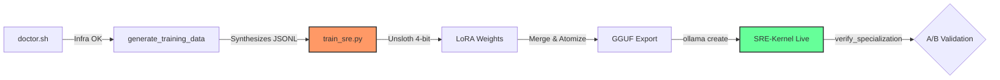

# 🧠 SRE-Kernel: Autonomous Model Specialization Factory

Welcome to the **SRE-Kernel Model Factory**. This facility enables the autonomous specialization of Large Language Models (LLMs) into elite Site Reliability Engineering (SRE) and DevSecOps experts, executed entirely on local, air-gapped infrastructure.

## 🏛️ Architectural Philosophy
The "SRE-Kernel" is not just an LLM; it is a context-anchored, domain-specific brain. It is trained using **4-bit QLoRA (Quantized Low-Rank Adaptation)** and optimized via **Unsloth** for maximum throughput on consumer-grade high-VRAM hardware (RTX 3060 12GB+).

### The Specialization Loop:
1.  **Expert Bootstrapping**: Infusing the model with synthetic "Senior SRE" intuition.
2.  **Local Ground-Truth**: Learning from your cluster's actual post-mortems and logs.
3.  **GGUF Atomization**: Exporting weights for high-performance inference in Ollama.
4.  **A/B Validation**: Technical verification against base general-purpose models.

---

## 🚀 One-Click Specialization Pipeline

The entire pipeline is orchestrated via a single high-end automation suite.



```bash
# Execute the full specialization loop
./ai-lab/specialize-model.sh
```

### What this orchestrator handles autonomously:
| Phase | Tool | Description |
| :--- | :--- | :--- |
| **Infra Check** | `doctor.sh` | Verifies NVIDIA CUDA, VRAM occupancy, and Conda residency. |
| **Data Synthesis** | `generate_training_data.py` | Scans `./post-mortems` and merges with the Expert Bootstrap Library. |
| **Fine-Tuning** | `train_sre.py` | Executes 100+ steps of 4-bit fine-tuning using Unsloth. |
| **GGUF Export** | `Unsloth Core` | Merges LoRA weights and atomizes into a single GGUF artifact. |
| **Registration** | `ollama create` | Anchors the model via the `ai-lab/Modelfile` (Zero-Trust Persona). |
| **A/B Testing** | `verify_specialization.py` | Validates technical RCA precision vs general-purpose LLMs. |

---

## 🛠️ Specialized Tooling Reference

### 🎓 The Trainer (`train_sre.py`)
Highly optimized for hardware with 12GB of VRAM. It uses **Gradient Checkpointing** and **4-bit Quantization** to deliver state-of-the-art results without requiring data-center GPUs.

### 🛡️ The Context Anchor (`Modelfile`)
Defines the **SRE-Kernel Persona**. It enforces technical precision, absolute conciseness, and compliance with Zero-Trust and GitOps philosophies.

### 🧪 The Validator (`verify_specialization.py`)
Performs technical A/B testing. It compares the response of `llama3` vs `sre-kernel` on specific, high-complexity failure scenarios found in this laboratory.

---

## 🔒 Security & Privacy
Because training occurs entirely in the `sre-ai-lab` Conda environment on your local hardware, **no infrastructure data, logs, or post-mortems ever leave your secure perimeter.** This is a fundamental requirement for Tier-1 DevSecOps practitioners.

---
*Status: Professional SRE-Kernel Factory Operational.*
