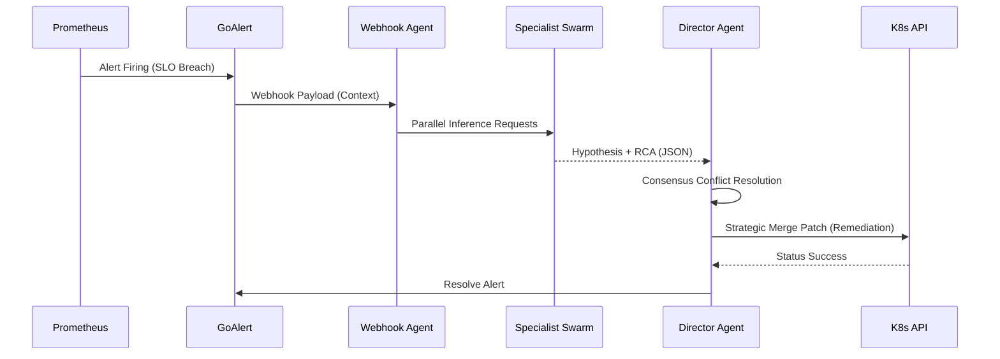

# 🧠 MAS Logic & Consensus Mechanism
> **Tier-1 Architectural Deep Dive: v4.2.0**

The **Autonomous Multi-Agent System (MAS)** is the "Pre-Frontal Cortex" of the AI4ALL-SRE Laboratory. It transition traditional metrics-based alerting into "Agentic Remediation".

## 🧩 The Specialist Swarm

Each incident is analyzed by a swarm of specialized agents, each with a distinct persona and domain expertise:

| Agent | Domain | Tools/Context |
| :--- | :--- | :--- |
| **Director** | Consensus | Final Decision Engine, K8s API Executor |
| **Network** | Connectivity | Linkerd Spans, Ingress Logs, DNS Status |
| **Database** | Persistence | Postgres/Redis Metrics, PVC Health, I/O Wait |
| **Compute** | Infrastructure | CPU/MEM Throttling, Node Pressure, OOM Kills |

---

## 🛰️ Decision Loop Workflow

The system follows a strict **Detect-Analyze-Consensus-Execute** loop:

### 1. Context Assembly
The Webhook Agent receives the alert and automatically queries the **Vector Memory** for historical context (e.g., "Was this pod OOMing last Tuesday?").

### 2. Specialist Hypothesis
Specialists do not talk to each other initially. They generate independent hypotheses based on their specific domain prompts. This prevents "groupthink" and ensures a diverse set of RCA possibilities.

### 3. Consensus & Conflict Resolution
The **Director Agent** evaluates the specialist outputs. 
- If consensus is reached (>66% agreement), the action is queued.
- If conflict arises (e.g., Network says "Latency" but Compute says "OOM"), the Director performs a **Deep Trace Analysis** via Tempo to break the tie.

### 4. Safety Guardrails
Before execution, the proposed action is validated against a **Governance Whitelist**:
- **Forbidden Namespaces**: `kube-system`, `cert-manager`.
- **Destructive Actions**: `DELETE NAMESPACE` is strictly blocked.
- **APF Protection**: Requests are tagged with a lower priority to ensure human overrides are always possible.

---

## 🛠️ Implementation Detail
The MAS logic resides in `ai_agent.py` and is configured via `observability.tf`. The agent personas are defined as "System Prompts" stored in Kubernetes ConfigMaps, allowing for hot-swapping agent personalities without restarting the control plane.
