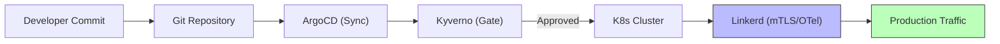

# 🏗️ Platform Engineering: Manifesto for Self-Service Reliability
> **Tier-1 Engineering Standard: v4.2.0**

The AI4ALL-SRE Laboratory is an **Internal Developer Platform (IDP)** meticulously designed to provide "Golden Paths" for high-resilience application engineering. Our philosophy is rooted in the belief that reliability should be a frictionless default.

---

## 🎯 The Platform Mission

Our mission is to minimize developer cognitive load while enforcing institutional standards of security and reliability. We transition from "Ops as a Service" to **Reliability as a Platform Product**.

### 1. Golden Paths vs. Rigid Guardrails
- **Golden Path**: A pre-orchestrated lifecycle for microservices, inclusive of Linkerd mTLS, OpenTelemetry instrumentation, and ArgoCD synchronization.
- **Guardrail**: Invisible, non-blocking policies (Kyverno) that ensure deployments remain within the safety perimeter without requiring manual intervention.

### 2. Infrastructure as Code (IaC) Governance
Standardized environments are the immutable foundation of reliability.
- **Provider Parity**: Technical state is managed exclusively via Terraform, from bare metal (K3s) to high-level incident response (GoAlert).
- **GitOps Reconciliation**: ArgoCD acts as the primary orchestrator, ensuring the live state is continuously reconciled against the Git source of truth.

---

## 📈 Platform Maturity Model

We classify platform evolution across three distinct tiers of operational excellence:

| Tier | Capability | Outcome |
| :--- | :--- | :--- |
| **I: Observability** | Centralized Logging & Metrics | "We know *when* it fails." |
| **II: Governance** | Policy-as-Code & Admission Gates | "We *prevent* common failures." |
| **III: Autonomous** | AI Multi-Agent Remediation | "The platform *heals* itself." |

---

## 🛠️ Core Platform Primitives

### Self-Service Chaos (The Adversary Store)
We treat resilience as a feature. Developers are provided with a [Predefined 📦 Store](../how-to/run-chaos-experiments.md#step-2-triggering-a-disaster) of failure scenarios to validate their service architectures in a controlled, non-destructive manner.

### Zero-Touch Observability (The LGTM Stack)
The platform provides an integrated **Loki, Grafana, Tempo, and Mimir** suite.
- **Ambient Instrumentation**: Linkerd sidecars automatically derive L7 signals (RPS, Latency, Errors).
- **Semantic Trace Correlation**: Alerts are enriched with TraceIDs, allowing for instantaneous transition from signal to sub-system source.

---

## 📊 Success Metrics & KPIs

| Metric | Business Value | Target |
| :--- | :--- | :--- |
| **MTTR (Self-Healing)** | Extreme Resilience | < 120s |
| **Golden Path Adoption** | Standardized Security | > 95% |
| **Cognitive Load Index** | Developer Velocity | Low |
| **Deployment Success** | Low Change Failure Rate | > 99% |

---
*Platform Engineering Lead: AI4ALL-SRE Engineering*
