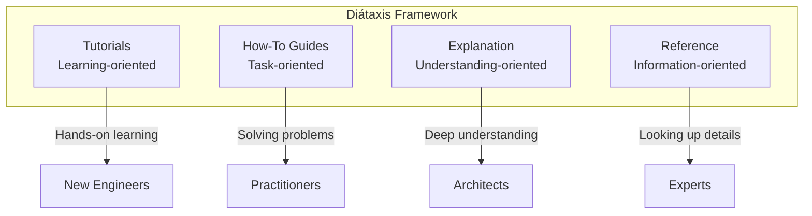
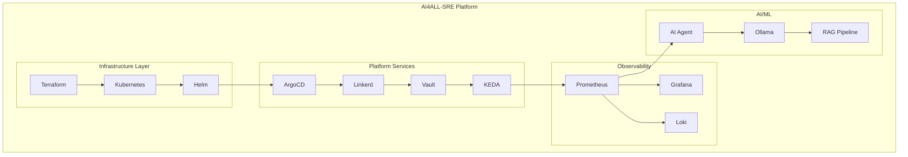

# AI4ALL-SRE Documentation Portal

> **Enterprise-Grade Internal Developer Platform for SRE, DevSecOps, and Autonomous AI Agents**

---

## Welcome to AI4ALL-SRE

AI4ALL-SRE is a sophisticated, production-grade Internal Developer Platform (IDP) that demonstrates modern Site Reliability Engineering (SRE) practices through an **Autonomous Multi-Agent System (MAS)** capable of detecting, analyzing, and remediating infrastructure incidents at machine speed.

---

## Documentation Structure

This documentation follows the [Diátaxis framework](https://diataxis.fr/) for technical documentation:



| Section | Purpose | Best For |
|---------|---------|----------|
| [**Tutorials**](tutorials/)] | Step-by-step learning paths | New engineers getting started |
| [**How-To Guides**](how-to/)] | Task-oriented solutions | Solving specific problems |
| [**Explanation**](explanation/)] | Conceptual understanding | Understanding architecture |
| [**Reference**](reference/)] | Technical specifications | Looking up details |

---

## Quick Navigation

### Getting Started

| Document | Description |
|----------|-------------|
| [Quickstart Guide](tutorials/01-quickstart.md)] | Get up and running in 10 minutes |
| [AI Model Fine-tuning](tutorials/02-ai-model-finetuning.md)] | Train your own SRE-Kernel model |
| [Disaster Recovery](how-to/disaster-recovery-dry-runs.md)] | Practice infrastructure recovery |

### Architecture Deep Dives

| Document | Description |
|----------|-------------|
| [System Architecture](reference/system-architecture.md)] | Complete platform architecture |
| [Multi-Agent System](explanation/mas-logic.md)] | AI agent coordination logic |
| [Circuit Breaker Pattern](reference/circuit-breaker-pattern.md)] | Resilience pattern implementation |

### Operations

| Document | Description |
|----------|-------------|
| [Remote State Migration](how-to/remote-state-migration.md)] | Migrate to enterprise backend |
| [Chaos Experiments](how-to/run-chaos-experiments.md)] | Run controlled failure injection |
| [Observability Stack](reference/observability-stack.md)] | Prometheus/Grafana/Loki setup |
| [Pause and Resume](how-to/pause-and-resume-laboratory.md)] | Save compute by pausing workloads |

---

## Platform Overview

### Core Components



### Technology Stack

| Category | Technology | Purpose |
|----------|------------|---------|
| **Infrastructure** | Terraform | Multi-cloud Infrastructure as Code |
| **Orchestration** | Kubernetes (K3s) | Container orchestration |
| **GitOps** | ArgoCD | Continuous deployment from Git |
| **Service Mesh** | Linkerd | mTLS, traffic management |
| **Secrets** | HashiCorp Vault | Dynamic secrets, PKI |
| **Autoscaling** | KEDA | Event-driven autoscaling |
| **Observability** | Prometheus + Grafana + Loki | Metrics, dashboards, logs |
| **AI Inference** | Ollama + Llama 3 | Local LLM inference |
| **Vector Store** | FAISS + ChromaDB | RAG similarity search |
| **Chaos** | Chaos Mesh | Controlled failure injection |

---

## Methodologies Implemented

### 1. Site Reliability Engineering (SRE)

| Pillar | Implementation |
|--------|----------------|
| **SLIs/SLOs** | Prometheus recording rules, error budget calculations |
| **Toil Automation** | Autonomous AI agent for self-healing |
| **Incident Response** | Multi-agent system with <120s MTTR |
| **Capacity Planning** | KEDA autoscaling with custom metrics |
| **Post-mortems** | Historical incidents indexed in RAG |

### 2. DevSecOps

| Layer | Tools |
|-------|-------|
| **Pre-commit** | Gitleaks, Bandit, ShellCheck |
| **CI/CD** | Trivy, tfsec, pip-audit |
| **Runtime** | Linkerd mTLS, Kyverno policies, Vault |
| **Supply Chain** | Cosign signing, SLSA provenance |

### 3. GitOps

| Principle | Implementation |
|-----------|----------------|
| **Declarative** | Terraform + Kubernetes manifests |
| **Versioned** | All infrastructure in Git |
| **Automated** | ArgoCD continuous reconciliation |
| **Auditable** | Full change history |

### 4. Multi-Agent System (MAS)

| Agent | Domain | Capabilities |
|-------|--------|--------------|
| **Director** | Orchestration | Alert triage, specialist dispatch |
| **Network** | Service Mesh | Linkerd, network policies |
| **Database** | Storage | PV/PVC, storage classes |
| **Compute** | Resources | CPU/Memory, HPA, quotas |

---

## Architecture Decision Records

| ADR | Title | Status |
|-----|-------|--------|
| [ADR-001](adr/ADR-001-vector-db-selection.md)] | Vector Database Selection | Accepted |
| [ADR-002](adr/ADR-002-llm-orchestration.md)] | LLM Orchestration Architecture | Accepted |

---

## Scripts Reference

### Master Scripts

| Script | Command | Purpose |
|--------|---------|---------|
| `setup.sh` | `./scripts/setup.sh` | Full platform setup |
| `destroy.sh` | `./scripts/destroy.sh` | Clean teardown |
| `validate.sh` | `./scripts/validate.sh` | Pipeline validation |
| `security-scan.sh` | `./scripts/security-scan.sh` | Security gates |
| `e2e_test.sh` | `./scripts/e2e_test.sh` | End-to-end testing |

### Makefile Commands

```bash
make setup              # Full platform setup
make setup-infra        # Stage 1: Infrastructure
make setup-platform     # Stage 2: Platform services
make destroy            # Clean teardown
make test-lifecycle     # Zero-to-hero test
make test-e2e           # Comprehensive E2E
make security-scan      # Security scanning
make enterprise-on      # Enable remote state
make enterprise-off     # Revert to local mode
```

---

## Testing Strategy

| Test Type | Location | Command |
|-----------|----------|---------|
| **Unit Tests** | `tests/test_*.py` | `python3 -m pytest tests/ -v` |
| **Integration** | `tests/integration/` | `./tests/integration/test_autonomous_loop.sh` |
| **E2E** | `scripts/e2e_test.sh` | `./scripts/e2e_test.sh` |
| **Lifecycle** | `scripts/lifecycle_test.sh` | `make test-lifecycle` |
| **Security** | `scripts/security-scan.sh` | `make security-scan` |
| **Chaos** | `scripts/proof-of-resilience.sh` | `./scripts/proof-of-resilience.sh` |

---

## Contributing

1. Review the [Contribution Guide](explanation/platform-engineering-manifesto.md)
2. Follow the [Code Style Guidelines](reference/code-style.md)
3. Run `make security-scan` before submitting PRs
4. Update documentation for new features

---

## Support

- **Issues**: [GitHub Issues](https://github.com/fbscotta369/ai4all-sre/issues)
- **Discussions**: [GitHub Discussions](https://github.com/fbscotta369/ai4all-sre/discussions)
- **Security**: See [SECURITY.md](../SECURITY.md) for vulnerability reporting
