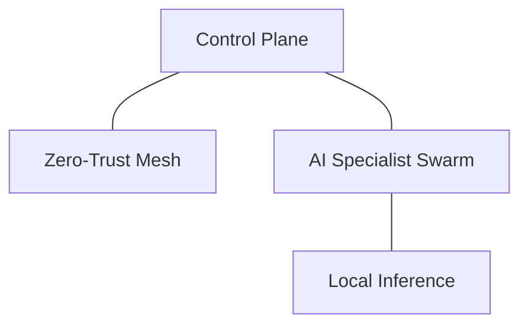

# 🤖 AI4ALL-SRE: The Autonomous Engineering Laboratory
> **Tier-1 Technical Documentation: v4.2.0**

AI4ALL-SRE is an enterprise-grade laboratory and **Internal Developer Platform (IDP)** for researching the intersection of SRE, DevSecOps, and Autonomous AI Agents. It provides a full-stack, local-first environment for evolving "Self-Healing" infrastructures.

---

## 🏗️ Architecture & Philosophy

The system is built on a **Zero-Trust Data Mesh** and an **Autonomous Multi-Agent System (MAS)**.

- **Local-First AI**: Specialized "SRE-Kernels" (Llama 3 base) running on local GPUs via Ollama.
- **Zero-Trust Mesh**: mTLS and Authorization at every hop via Linkerd.
- **GitOps Core**: Infrastructure and application state managed exclusively via Terraform and ArgoCD.
- **Autonomous Loop**: A feedback-driven system that Detects (Prometheus), Analyzes (MAS Agents), and Remediates (K8s API) in < 120 seconds.

---

## 📂 Documentation Structure (Diátaxis Alignment)

Our documentation hub is designed for professional engineering onboarding.

| Category | Description | Key Documents |
| :--- | :--- | :--- |
| **🚀 Tutorials** | Guided onboarding for new engineers. | [Quickstart Guide](tutorials/01-quickstart.md) |
| **🛠️ How-To** | Practical SOPs and Command Reference. | [Command Reference](how-to/command-reference.md) |
| **🏗️ Reference** | Technical specifications and C4 models. | [Testing Framework](reference/testing-framework.md) |
| **🧠 Explanation** | Deep-dives into our engineering philosophy. | [MAS Logic](explanation/mas-logic.md) |

---

## ⚡ Quickstart: The Golden Path

```bash
# 1. Initialize the Hardware & Cluster Plane
./setup.sh

# 2. Deploy the AI SRE Agent
npx -y pm2 start ai_agent.py --interpreter python3

# 3. Trigger a Chaos Experiment
kubectl apply -f chaos/network-delay.yaml
```

---

## 🏗️ Architecture & Philosophy

The system is built on a **Zero-Trust Data Mesh** and an **Autonomous Multi-Agent System (MAS)**.



- **Local-First AI**: Specialized "SRE-Kernels" running on local GPUs.
- **Zero-Trust Mesh**: mTLS and Authorization at every hop via Linkerd.
- **GitOps Core**: State managed exclusively via Terraform and ArgoCD.

---

## 👥 Meet the Specialist Swarm

The **Autonomous MAS** consists of specialized agents that collaborate on incident resolution:
- 🌐 **Network Specialist**: Linkerd/Traffic Analysis.
- 💾 **Database Specialist**: State & Storage Integrity.
- ⚙️ **Compute Specialist**: CPU/Memory profiling.
- 🎬 **Director Agent**: Consensus and Execution Engine.

---
*Engineering Lead: AI4ALL-SRE Platform*
