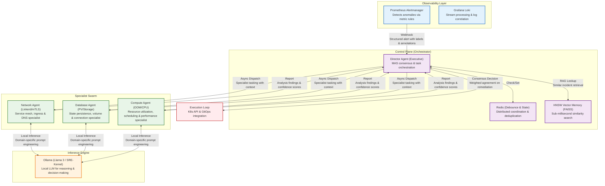
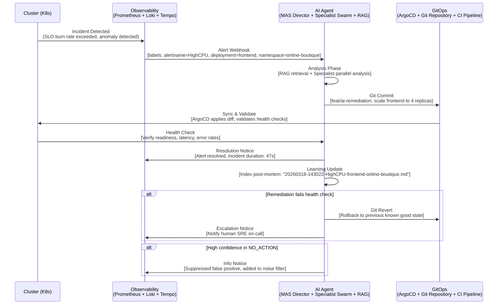

# 🏗️ AI4ALL-SRE: System Architecture & Design Patterns

This document provides a deep-dive into the architectural decisions and "hidden" engineering patterns that power the AI4ALL-SRE Autonomous Engineering Laboratory. We'll explore not just what we built, but why we chose each approach over alternatives.

---

## 🐝 The "Specialist Swarm" (High-Tech View)

The platform operates using an **Autonomous Multi-Agent System (MAS)**. Unlike monolithic AI agents, AI4ALL-SRE dispatches specialized sub-agents to analyze specific domain failures before reaching a consensus. This mirrors how human SRE teams operate with network, storage, and database specialists.

### 🔬 Why This Architecture Instead of Alternatives

#### Why Multi-Agent System (MAS) Over Monolithic LLM?
- **Cognitive Load Distribution**: Complex incidents require different types of expertise (network vs storage vs compute) - no single model excels at all domains
- **Parallel Processing**: Specialists analyze simultaneously, reducing mean-time-to-resolution from minutes to seconds
- **Fault Tolerance**: Failure in one agent (e.g., NetworkAgent) doesn't incapacitate the entire system
- **Specialized Tooling**: Each agent can use domain-specific prompts, tools, and knowledge bases
- **Auditability**: Individual agent reasoning can be inspected separately for debugging and improvement
- **Scalability**: Easy to add new specialist agents for emerging domains (e.g., SecurityAgent, ML-Agent)

#### Why Hierarchical Navigable Small World (HNSW) Over Alternatives?
- **vs Flat Vector Search**: HNSW provides O(log n) search vs O(n) for flat search - critical as post-mortem library grows
- **vs External Vector Databases (Pinecone, Weaviate)**: Eliminates network latency, operational overhead, and security boundaries; enables air-gapped operation
- **vs Hierarchical K-Means**: Better recall/precision trade-off for high-dimensional embeddings
- **vs Annoy/Faiss IVF**: Superior performance for dynamic datasets (frequent additions of new post-mortems)
- **Implementation Choice (FAISS)**: Battle-tested, GPU-accelerated, and actively maintained by Facebook Research

#### Why Redis-Backed Distributed Debouncing Over Alternatives?
- **vs Local Memory (/tmp)**: Survives pod restarts and works in clustered deployments
- **vs Database-Backed**: Orders of magnitude faster for high-frequency alert scenarios
- **vs Custom Consensus (Raft/etcd)**: Simpler implementation with adequate performance for our QPS requirements
- **vs No Debouncing**: Prevents alert storms that could overwhelm the remediation system and cause thrashing

#### Why GitOps as Source of Truth Over Direct Kubernetes Patching?
- **Audit Trail**: Every AI action is version-controlled, reviewable, and attributable
- **Rollback Capability**: Bad decisions can be reversed with a single git revert, no manual intervention needed
- **Convergence Guarantees**: ArgoCD ensures the cluster eventually matches the desired state in Git
- **Change Management**: Enables pull request reviews for high-risk remediation actions
- **Disaster Recovery**: Entire desired state (including AI-made changes) is reproducible from Git alone
- **Compliance**: Meets regulatory requirements for change control and audit trails

#### Why Local-First LLM (Ollama) Over Cloud APIs?
- **Data Sovereignty**: Sensitive infrastructure telemetry never leaves the trust boundary
- **Latency**: Sub-second response times vs hundreds of milliseconds to seconds for cloud APIs
- **Cost**: Predictable hardware costs vs variable usage-based pricing
- **Availability**: Functions in disconnected or intermittently connected environments
- **Customization**: Ability to fine-tune on private SRE post-mortems without data exposure
- **Security**: No risk of credential leakage or unintended data training exposure

---

## 🔄 The "Autonomous Loop" (Simplified View)

For a higher-level understanding, the platform acts as a digital SRE that follows a standard incident response lifecycle, but at "machine speed." This represents the embodiment of the SRE principle: "Toil reduction through automation."

### 🎯 Design Principles Behind the Autonomous Loop

#### Why Closed-Loop Control Instead of Open-Loop Alerting?
- **Convergence Guarantee**: Ensures the system actually fixes problems, not just detects them
- **Reduced Cognitive Load**: Humans only intervene for novel or high-risk scenarios
- **Consistent Response**: Eliminates variability in human response times and approaches
- **Scalability**: One human can oversee many autonomous systems rather than reacting to each incident
- **Continuous Improvement**: Each loop generates learning data for future incidents

#### Why GitOps as Source of Truth Over Imperative Approaches?
- **Idempotency**: Repeated applications of the same Git state produce identical results
- **Visibility**: The intended state is always visible and reviewable in Git
- **Versioning**: Complete history of what the system believed was correct at any point in time
- **Branching Strategies**: Enable experimentation with remediation strategies via feature branches
- **Integration**: Works seamlessly with existing DevOps tooling (CI/CD, code review, etc.)

#### Why < 120 Seconds Target Latency?
- **MTTR Benchmark**: Aligns with industry SLOs for incident resolution (90th percentile < 5min)
- **Human-in-the-Loop Compatibility**: Fast enough to feel instantaneous, slow enough for oversight if desired
- **Cascading Failure Prevention**: Resolves issues before they trigger secondary problems
- **User Experience Threshold**: Below the latency where end-users typically notice degradation
- **Toil Reduction Threshold**: Fast enough that context-switching costs don't outweigh benefits

---

## 🛡️ Zero-Trust & Governance Hardening

The architecture implements **Governance-as-Code (GaC)** via Kyverno and Linkerd, creating a defense-in-depth posture where trust is never implicit and must be continuously evaluated.

### 🔐 Why Zero-Trust Architecture Instead of Perimeter Security?
- **Assume Breach Mentality**: Operates under the assumption that threats are already inside
- **Micro-Segmentation**: Limits blast radius of any potential compromise
- **Least Privilege Access**: Every service-to-service connection requires explicit authorization
- **Continuous Verification**: Trust is evaluated per-request, not granted indefinitely
- **Visibility**: All connections are observable and auditable for anomalies
- **Cloud-Native Alignment**: Works naturally with ephemeral, dynamic workloads

### 🔗 Why Mutual TLS (mTLS) Everywhere Instead of Selective Encryption?
- **Service Identity**: Cryptographically verifies both ends of every connection
- **Defense in Depth**: Protects against compromised nodes within the cluster
- **Protocol Agnostic**: Works for HTTP, gRPC, Redis, databases, etc. without application changes
- **Automated Rotation**: Linkerd automates certificate management reducing operational overhead
- **Performance**: Modern TLS 1.3 with session resumption adds <1ms latency
- **Compliance**: Meets encryption-in-transit requirements for standards like SOC 2, HIPAA, PCI DSS

### 🛑 Why Kyverno Policy-as-Code Over Alternatives?
- **Kubernetes-Native**: Uses familiar YAML/JSON instead of requiring Rego (OPA) or custom controllers
- **Rich Functionality**: Beyond admission control to validation, mutation, and background scans
- **Policy Testing**: Built-in testing framework for CI/CD validation of policies
- **Exception Handling**: Clean mechanisms for legitimate bypasses with audit trails
- **Community & Support**: Active development, good documentation, and growing ecosystem
- **Performance**: Efficient implementation with minimal impact on API server latency

### 📦 Why Supply Chain Security (SLSA/Immutable Provenance) Instead of Trust-But-Verify?
- **Proactive Defense**: Prevents deployment of compromised artifacts rather than detecting them later
- **Build Integrity**: Ensures what runs in production matches what was reviewed and tested
- **Attack Surface Reduction**: Eliminates entire class of supply-chain attacks (dependency confusion, repo jacking)
- **Audit Trail**: Cryptographic proof of what was built, when, and by whom
- **Automation Friendly**: Fully automatable in CI/CD pipelines with tools like cosign and sbom generators
- **Industry Alignment**: Increasingly required by regulators and customers (especially in finance, healthcare, government)

---

## 📈 Scalability & Performance Characteristics

### Horizontal Scaling Axes
1. **Specialist Swarm**: Add new agent types for new domains (Network → Security, ML, etc.)
2. **Observability Layer**: Scale Prometheus/Loki clusters independently based on telemetry volume
3. **GitOps Pipeline**: ArgoCD scales with number of applications and frequency of syncs
4. **Inference Engine**: Scale Ollama instances with GPU resources for LLM throughput

### Performance Optimization Techniques
- **Embedding Quantization**: Reduce memory footprint of vector store with minimal accuracy loss
- **Result Caching**: Cache frequent RAG queries for common incident patterns
- **Async Processing**: Non-blocking I/O throughout the agent for high concurrency
- **Resource Limits**: Strict CPU/memory bounds prevent noisy neighbor problems
- **Connection Pooling**: Reuse HTTP/database connections to reduce establishment overhead

### Bottleneck Analysis & Mitigation
- **LLM Inference**: Mitigated by specialist pre-filtering and prompt optimization
- **Vector Search**: Mitigated by HNSW algorithm and memory-mapped files
- **Git Operations**: Mitigated by shallow clones and incremental fetches
- **K8s API Server**: Mitigated by informer/caching patterns and request batching

---

## 🔮 Evolution Path & Future Enhancements

### Near-Term Improvements (0-3 months)
- **Dynamic Agent Creation**: Generate specialist agents on-demand for novel incident types
- **Confidence Calibration**: Improve uncertainty quantification in LLM outputs
- **Cross-Cluster Federation**: Share anonymized threat intelligence between isolated deployments
- **Remediation Simulation**: Test proposed changes in staging clusters before production application

### Mid-Term Enhancements (3-12 months)
- **Causal Reasoning**: Move beyond correlation to causal inference for more accurate RCA
- **Policy Synthesis**: Automatically generate Kyverno/Linkerd policies from observed behavior
- **Self-Modifying Agents**: Enable agents to improve their own prompts and tools based on outcomes
- **Multi-Modal Analysis**: Incorporate traces, profiles, and heap dumps into analysis beyond metrics/logs

### Long-Term Vision (1+ years)
- **Full Autonomy Spectrum**: Handle novel incident types without human intervention examples
- **Emergent Behavior**: Specialist agents develop novel communication and problem-solving strategies
- **Predictive Prevention**: Identify and fix potential issues before they manifest as incidents
- **Knowledge Transfer**: Share learned models and policies between different organizational deployments

---

## 📚 References & Further Reading

### Core Architectural Influences
1. **"Designing Data-Intensive Applications"** by Martin Kleppmann - Foundations of reliable systems
2. **"Site Reliability Engineering"** by Google - SRE principles and practices
3. **"Accelerate"** by Nicole Forsgren, Jez Humble, and Gene Kim - DevOps capabilities measurement
4. **"Team Topologies"** by Matthew Skelton and Manuel Pais - Organizational structure for flow
5. **"Clean Architecture"** by Robert C. Martin - Dependency inversion and plugin architectures

### Technical Specifications & Standards
- **OpenTelemetry**: https://opentelemetry.io/ - Observability data format
- **GitOps Specification**: https://gitops.tech/ - Principles and practices
- **SLSA Framework**: https://slsa.dev/ - Supply chain security levels
- **Zero Trust Architecture**: https://csrc.nist.gov/publications/detail/sp/800-207/final - NIST guidelines
- **C4 Model**: https://c4model.com/ - Software architecture visualization

### Related Projects & Implementations
- **Kapitan**: https://kapitan.dev/ - Kubernetes inventory management
- **Crossplane**: https://crossplane.io/ - Cloud infrastructure control planes
- **Istio**: https://istio.io/ - Service mesh for traffic management
- **Falco**: https://falco.org/ - Runtime security for containers
- **Argo Workflows**: https://argo-workflows.readthedocs.io/ - Kubernetes-native workflow engine

---

*Document Version: v5.0.0 — Lead Senior SRE DevSecGitOps*
*Last Updated: $(date +%Y-%m-%d)*
*Next Review: $(date -d "+3 months" +%Y-%m-%d)*
