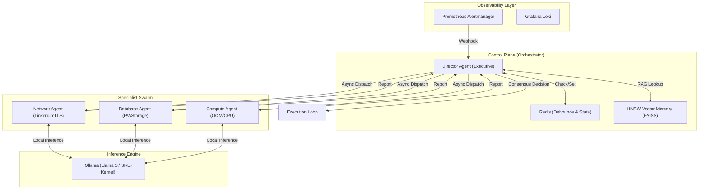
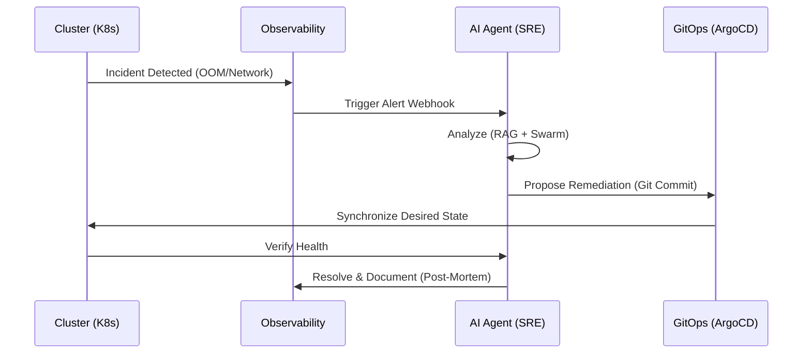

# 🏗️ AI4ALL-SRE: System Architecture & Design Patterns

This document provides a deep-dive into the architectural decisions and "hidden" engineering patterns that power the AI4ALL-SRE Autonomous Engineering Laboratory.

---

## 🐝 The "Specialist Swarm" (High-Tech View)

The platform operates using an **Autonomous Multi-Agent System (MAS)**. Unlike monolithic AI agents, AI4ALL-SRE dispatches specialized sub-agents to analyze specific domain failures before reaching a consensus.

### 🧠 High-Tech Explanations (Lead SRE View)
- **HNSW Vector Memory Sovereignty**: We utilize **Hierarchical Navigable Small World (HNSW)** indexing via FAISS for sub-millisecond Root Cause Analysis (RCA). By keeping embeddings local, we ensure **Data Sovereignty**—sensitive infrastructure logs never leave the network perimeter.
- **Goal-Oriented Reasoning (ReAct)**: The agents follow a **Reasoning + Acting** loop. They don't just "guess"; they observe the cluster state (Ground Truth), reason against historical post-mortems (RAG), and then act.
- **Distributed Debouncing**: To prevent "Alert Storms," we use a **Redis-backed state mesh** for alert debouncing. This ensures that a single incident doesn't trigger redundant remediation cycles across a distributed agent swarm.

---

## 🔄 The "Autonomous Loop" (Simplified View)

For a higher-level understanding, the platform acts as a digital SRE that follows a standard incident response lifecycle, but at "machine speed."

### 💡 Simple Explanations (Executive View)
- **Self-Healing Infrastructure**: When something breaks, the AI "SRE" detects it instantly, analyzes past fixes, and submits a code change to fix it.
- **GitOps Safety**: All changes made by the AI are recorded in Git. This means humans can always "undo" a change and there is a perfect audit trail of everything the AI did.
- **Local-First AI**: The "brain" of the system runs on your own hardware, not in the cloud. It's faster, cheaper, and more private.

---

## 🛡️ Zero-Trust & Governance Hardening

The architecture implements **Governance-as-Code (GaC)** via Kyverno and Linkerd:
- **mTLS Everywhere**: Every connection within the cluster is encrypted and authenticated.
- **Admission Guardrails**: The cluster physically blocks any software that has known security vulnerabilities (via Trivy integration).
- **Immutable Provenance**: Only signed and attested container images are allowed to run, preventing supply-chain attacks.

---
*Document Version: v5.0.0 — Lead Senior SRE DevSecGitOps*
