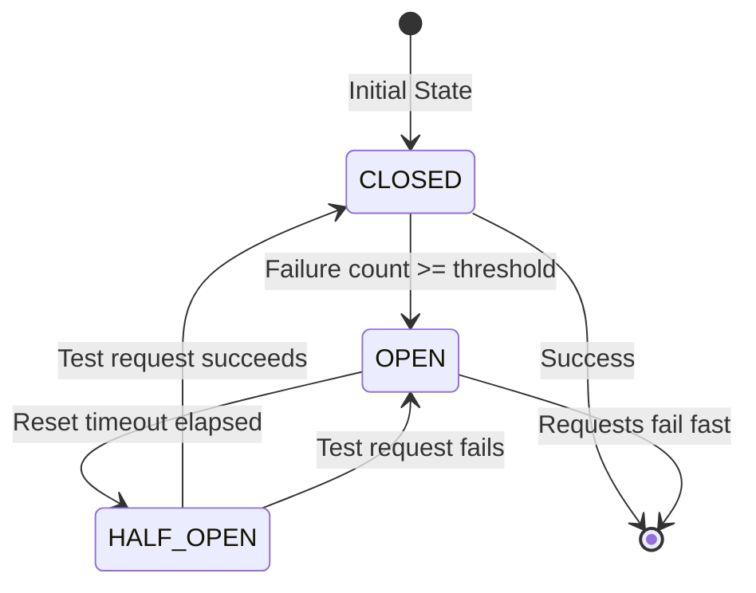

# Circuit Breaker Pattern Reference

> **Technical Reference: v5.1.0**

This document describes the Circuit Breaker pattern implementation in AI4ALL-SRE, which provides resilience for external dependencies.

## Overview

The Circuit Breaker pattern prevents cascading failures when external dependencies (Ollama, Redis, Kubernetes API) become unavailable. It wraps calls to these services and "trips" (opens) after repeated failures, preventing further requests until the service recovers.

## Architecture



### States

| State | Description | Behavior |
|-------|-------------|----------|
| **CLOSED** | Normal operation | Requests pass through, failures are counted |
| **OPEN** | Circuit tripped | Requests fail immediately, no calls to dependency |
| **HALF_OPEN** | Testing recovery | Single test request allowed, others fail fast |

## Implementation

### Pre-configured Circuit Breakers

AI4ALL-SRE provides pre-configured circuit breakers for all critical dependencies:

```python
from circuit_breaker import CircuitBreakers

# Ollama (LLM inference) - longer timeout for inference
result = CircuitBreakers.ollama.execute(query_function)

# Redis (debounce state) - fast recovery
result = CircuitBreakers.redis.execute(redis_operation)

# Kubernetes API
result = CircuitBreakers.k8s_api.execute(k8s_call)

# Git operations
result = CircuitBreakers.git.execute(git_operation)
```

### Configuration

Each circuit breaker has configurable parameters:

| Parameter | Default | Description |
|-----------|---------|-------------|
| `fail_max` | 3-5 | Number of failures before opening circuit |
| `reset_timeout` | 30-300s | Time before attempting recovery |
| `exclude_exceptions` | tuple | Exceptions that don't count as failures |
| `fallback_function` | None | Function to call when circuit is open |

### Custom Circuit Breaker

Create a custom circuit breaker for specific use cases:

```python
from circuit_breaker import CircuitBreaker

# Create custom circuit breaker
cb = CircuitBreaker(
    name="custom_service",
    fail_max=5,
    reset_timeout=60.0,
    exclude_exceptions=(ValueError,),
    fallback_function=lambda x: "fallback_result"
)

# Execute with protection
try:
    result = cb.execute(my_function, arg1, arg2)
except CircuitBreakerOpenError:
    # Handle open circuit
    print("Service unavailable, using cached data")
```

### Decorator Pattern

Use circuit breaker as a decorator:

```python
from circuit_breaker import circuit_breaker

@circuit_breaker(
    name="my_service",
    fail_max=3,
    reset_timeout=60.0
)
def my_service_call(param):
    # This function is now protected by circuit breaker
    return external_api_call(param)

# Access circuit breaker state
print(my_service_call.circuit_breaker.get_state())
```

## Integration with AI Agent

The AI Agent uses circuit breakers to protect against:

1. **Ollama failures**: When LLM inference is unavailable
2. **Redis failures**: When debounce state storage is down
3. **Kubernetes API failures**: When cluster API is unreachable
4. **Git failures**: When Git operations fail

### Fallback Strategies

Each circuit breaker has a fallback strategy:

| Dependency | Primary Action | Fallback |
|------------|---------------|----------|
| Ollama | LLM inference | Return error message |
| Redis | Distributed debounce | In-memory dictionary |
| K8s API | API calls | Log error, skip remediation |
| Git | Git operations | Direct API patch |

## Monitoring

### Health Endpoint

Circuit breaker states are exposed via the `/health` endpoint:

```json
{
  "status": "ok",
  "version": "5.1.0",
  "redis": true,
  "vector_store": "loaded",
  "ollama": "ok",
  "circuit_breakers": {
    "ollama": {"state": "CLOSED", "failure_count": 0},
    "redis": {"state": "CLOSED", "failure_count": 0},
    "k8s_api": {"state": "CLOSED", "failure_count": 0},
    "git": {"state": "CLOSED", "failure_count": 0}
  }
}
```

### Logging

Circuit breaker state changes are logged:

```
2024-01-15 10:30:45 | INFO | [CB:ollama] Circuit CLOSED (service recovered)
2024-01-15 10:31:12 | WARNING | [CB:redis] Circuit OPENED (failures: 5)
2024-01-15 10:32:45 | INFO | [CB:redis] Circuit transitioning to HALF_OPEN
```

## Testing

Run circuit breaker unit tests:

```bash
# Run all circuit breaker tests
python3 -m unittest tests.test_circuit_breaker

# Run specific test
python3 -m unittest tests.test_circuit_breaker.TestCircuitBreaker.test_circuit_opens_after_failures
```

### Test Coverage

The test suite covers:
- State transitions (CLOSED → OPEN → HALF_OPEN → CLOSED)
- Failure counting and thresholds
- Thread safety for concurrent requests
- Fallback function execution
- Excluded exceptions handling

## Best Practices

### 1. Choose Appropriate Thresholds
- **Fast-failing services**: Lower `fail_max` (2-3)
- **Slow-recovery services**: Higher `reset_timeout` (120-300s)
- **Critical services**: Use fallback functions

### 2. Monitor Circuit States
- Alert when circuits are OPEN for extended periods
- Track failure patterns to identify systemic issues
- Use metrics to tune thresholds

### 3. Implement Graceful Degradation
- Always provide fallback behavior when possible
- Cache successful responses for use during outages
- Return meaningful error messages to users

### 4. Test Circuit Breaker Behavior
- Simulate dependency failures in testing
- Verify fallback strategies work correctly
- Test thread safety under load

## Troubleshooting

### Circuit Stuck in OPEN State

**Symptoms**: Service never recovers, circuit remains OPEN

**Solutions**:
1. Check if `reset_timeout` is too short
2. Verify dependency is actually recovering
3. Check for excluded exceptions that should count as failures

### Too Many False Positives

**Symptoms**: Circuit opens during normal operation

**Solutions**:
1. Increase `fail_max` threshold
2. Add exceptions to `exclude_exceptions`
3. Check network connectivity and latency

### Fallback Not Working

**Symptoms**: Open circuit causes complete failure

**Solutions**:
1. Verify `fallback_function` is defined
2. Check fallback function signature matches original
3. Ensure fallback doesn't depend on failed service

## References

- [Martin Fowler: Circuit Breaker Pattern](https://martinfowler.com/bliki/CircuitBreaker.html)
- [Netflix Hystrix Documentation](https://github.com/Netflix/Hystrix/wiki)
- [Source Code: circuit_breaker.py](../../components/ai-agent/circuit_breaker.py)