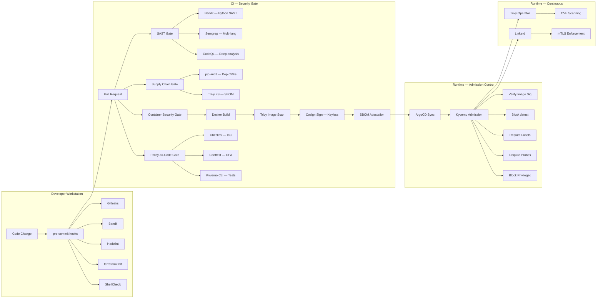

# DevSecOps Pipeline Reference

## Overview

The AI4ALL-SRE platform implements a **Shift-Left DevSecOps** strategy that embeds security
validation at every stage of the software development lifecycle — from developer workstation
through CI/CD to runtime admission control and supply-chain attestation.

## Pipeline Architecture



## Tool Matrix

### Static Analysis (SAST)

| Tool | Scope | Integration | Enforcement |
|:---|:---|:---|:---|
| **Bandit** | Python source code | CI + pre-commit | Fail on HIGH+ severity |
| **Semgrep** | Python, Terraform, Dockerfile, K8s, secrets | CI (Semgrep Action) | Fail on findings |
| **CodeQL** | Deep semantic analysis (Python) | CI (GitHub Advanced Security) | Security alerts |
| **ShellCheck** | Bash scripts | CI + pre-commit | Fail on warnings |
| **Hadolint** | Dockerfiles | CI + pre-commit | Lint warnings |

### Supply Chain Security

| Tool | Purpose | Integration | Output |
|:---|:---|:---|:---|
| **pip-audit** | Python dependency CVE scanning | CI + local script | Fail on known CVEs |
| **Trivy (fs)** | Filesystem SBOM + vuln scan | CI | CycloneDX SBOM artifact |
| **Trivy (image)** | Container image CVE scanning | CI | Fail on CRITICAL |
| **Cosign** | Image signing (Sigstore keyless) | CI (main branch) | Signed image + attestation |
| **SLSA** | Provenance attestation (Level 3) | CI (slsa-github-generator) | In-toto provenance |

### Infrastructure as Code (IaC)

| Tool | Purpose | Integration | Enforcement |
|:---|:---|:---|:---|
| **Checkov** | Terraform + K8s policy scan | CI | Fail on violations |
| **tfsec** | Terraform-specific security scan | CI | Security findings |
| **Conftest (OPA)** | Custom Rego policy validation | CI | Fail on deny rules |
| **terraform fmt** | Code formatting | CI + pre-commit | Fail on diff |
| **terraform validate** | HCL syntax validation | CI + pre-commit | Fail on errors |

### Runtime Admission Control (Kyverno)

| Policy | Action | Category |
|:---|:---|:---|
| `disallow-privileged-containers` | **Enforce** | Pod Security |
| `require-resource-limits` | Audit | Resource Management |
| `mutate-resource-limits` | Audit (mutate) | Resource Management |
| `enforce-linkerd-injection` | **Enforce** | Zero-Trust mTLS |
| `restrict-image-registries` | Audit | Supply Chain |
| `block-critical-vulnerabilities` | Audit | CVE Prevention |
| `require-image-digest` | **Enforce** | Supply Chain |
| `verify-image-signatures` | Audit → Enforce | Supply Chain |
| `require-mandatory-labels` | Audit | Governance / FinOps |
| `require-probes` | Audit | Reliability |

## OPA/Conftest Policies

### Terraform Policies (`policy/terraform/`)

| Policy | Purpose |
|:---|:---|
| `deny_public_access.rego` | Block unrestricted ingress, public S3/ LBs |
| `require_encryption.rego` | Require encryption on RDS, EBS, S3 |
| `require_tags.rego` | Enforce mandatory tags (team, environment, cost-center, managed-by) |

### Kubernetes Policies (`policy/kubernetes/`)

| Policy | Purpose |
|:---|:---|
| `deny_host_network.rego` | Block hostNetwork usage outside system namespaces |
| `require_resource_limits.rego` | Require CPU/memory limits on all containers |

## CI Workflows

| Workflow | Trigger | Purpose |
|:---|:---|:---|
| `sre-pipeline.yml` | Push/PR to main | Lint, SAST, IaC scan, SBOM, secret scan |
| `security-gate.yml` | Push/PR to main | Dedicated 4-gate security pipeline |
| `docs-validation.yml` | Push/PR (docs/*) | Markdown lint, prose lint, build check |
| `ai-docs.yml` | Push (docs/*) | Build + deploy docs to GitHub Pages |

## Local Developer Workflow

### Install pre-commit hooks (one-time setup)

```bash
pip install pre-commit
pre-commit install
```

### Run security scan before pushing

```bash
./scripts/security-scan.sh          # Full scan (8 checks)
./scripts/security-scan.sh --quick  # Fast scan (skip Terraform validate)
```

### What the pre-commit hooks check

Every `git commit` automatically runs:

1. **Gitleaks** — secret detection
2. **Bandit** — Python SAST (HIGH+ severity)
3. **terraform fmt** — formatting check
4. **terraform validate** — HCL validation
5. **tfsec** — Terraform security scan
6. **yamllint** — YAML validity
7. **ShellCheck** — bash script analysis
8. **Hadolint** — Dockerfile best practices
9. **detect-private-key** — prevent key commits
10. **no-commit-to-branch** — block direct pushes to main

## Compliance Mapping

| Framework | Relevant Controls |
|:---|:---|
| **NIST 800-53** | CM-2, CM-6, SI-2, SI-4, SA-11, SC-28 |
| **SOC 2 Type II** | CC6.1, CC6.6, CC7.1, CC8.1 |
| **CIS Kubernetes** | 5.1.x, 5.2.x, 5.4.x, 5.7.x |
| **SLSA** | Level 3 (provenance + signed artifacts) |
| **OWASP** | A06:2021 (Vulnerable Components), A08:2021 (Software Integrity) |
