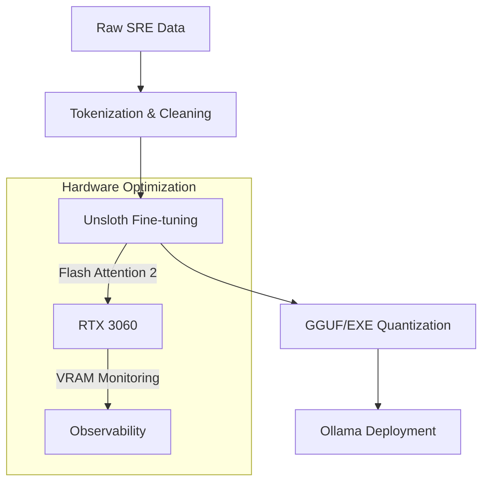

# Hardware Optimizations (Ryzen 9 / RTX 3060)

This document outlines the specific hardware configurations and optimizations implemented for the AI4ALL-SRE Laboratory to maximize LLM fine-tuning performance and system stability.

## System Specifications
- **CPU**: AMD Ryzen 9 (High-thread count for data preprocessing)
- **GPU**: NVIDIA RTX 3060 (12GB VRAM - optimized for Unsloth)
- **OS**: Kubuntu 22.04 LTS (Optimized for ML workflows)

## NVIDIA / Kubuntu Fixes

### 4K UI Scaling
To fix blurry fonts and UI scaling issues on 4K monitors:
1. Open **System Settings** -> **Display and Monitor**.
2. Set **Global Scale** to 150% (or 200%).
3. Add the following to `.xprofile`:
   ```bash
   export GDK_SCALE=2
   export GDK_DPI_SCALE=0.5
   export QT_AUTO_SCREEN_SCALE_FACTOR=1
   ```

### Color Range Fix
If colors appear washed out (limited RGB range):
```bash
# Force Full RGB Range
xrandr --output <YOUR_DISPLAY_ID> --set "Broadcast RGB" "Full"
```

## CUDA & Unsloth Optimizations
- **Driver Version**: 535+ (Recommended for CUDA 12.1)
- **Triton Configuration**: `export TRITON_PTXAS_PATH=$(which ptxas)` to ensure Unsloth can find the compiler.
- **Memory Management**: Using `bitsandbytes` 4-bit quantization to fit larger models into the 12GB VRAM.

## Training Pipeline Map

