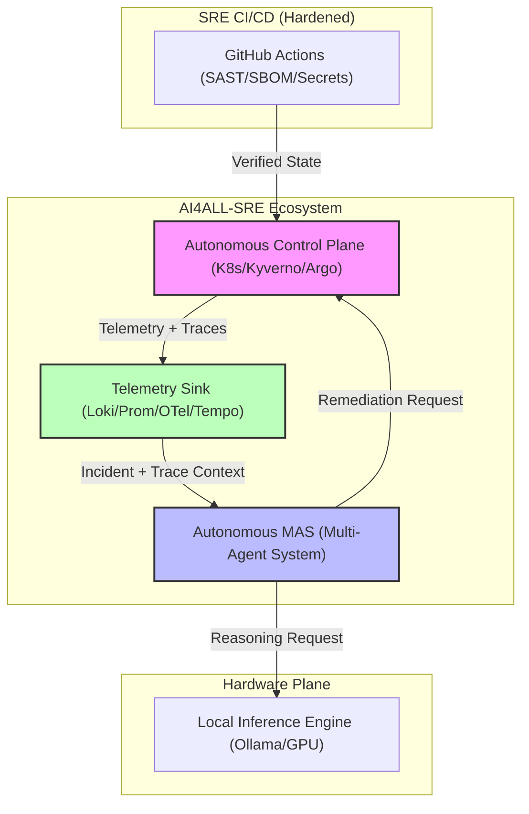
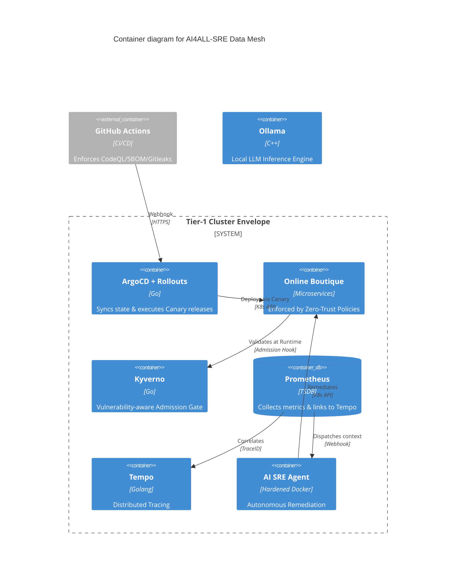
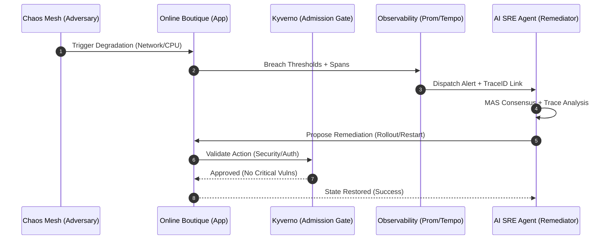

# Reference: System Architecture (C4 Model) 🏗️

This document defines the technical architecture of the AI4ALL-SRE Laboratory. It is structured according to the **C4 Model** and documents the boundaries of the control plane and data mesh.

---

## Core Design Principles

1.  **Local-First Autonomy**: All reasoning (LLM) and data storage happen within the laboratory perimeter to ensure 100% data sovereignty and low-latency decision loops.
2.  **M2M Zero-Trust**: Machine-to-Machine communication is secured via explicit Linkerd **Server/Authorization** resources. Access is denied by default until an identity trust is established.
3.  **Governance-First Deployment**: Every new pod is validated by an Admission Controller (Kyverno) against live Vulnerability Data. Critical vulnerabilities block the build/deploy cycle.
4.  **Trace-Linked Alerting**: Incidents are born with a Distributed Trace context, allowing immediate correlation from a high-level alert (Prometheus) to a low-level Span (Tempo).

---

## C4 Model - Level 1: System Context

The AI4ALL-SRE Laboratory operates as an autonomous enclave bridging the gap between raw telemetry and corrective action.



---

## C4 Model - Level 2: Container (Data Mesh)

The system is a distributed **Data Mesh** where state is synchronized across asynchronous observers.



---

## C4 Model - Level 3: Component (MAS Reasoning)

The Autonomous SRE Agent is composed of a **Multi-Agent System (MAS)** (see `observability.tf` configmaps).

```mermaid
C4Component
    title Component diagram for AI SRE Agent

    Container_Boundary(api, "AI SRE Agent API") {
        Component(webhook, "Webhook Receiver", "FastAPI", "Receives GoAlert payload")
        
        Boundary(mas, "Specialist Swarm") {
            Component(net, "Network Agent", "LLM Context", "Analyzes Linkerd/Ingress")
            Component(db, "Database Agent", "LLM Context", "Analyzes State/Storage")
            Component(comp, "Compute Agent", "LLM Context", "Analyzes CPU/Memory")
        }
        
        Component(director, "Director Agent", "Consensus Engine", "Synthesizes final action from Swarm")
        Component(guard, "Safety Guardrail", "Python logic", "Checks APF and Kyverno rules")
        Component(exec, "K8s Executor", "client-python", "Applies patches to API server")
    }

    Rel(webhook, mas, "Dispatches context")
    Rel(net, director, "Submits hypothesis")
    Rel(db, director, "Submits hypothesis")
    Rel(comp, director, "Submits hypothesis")
    Rel(director, guard, "Proposes remediation")
    Rel(guard, exec, "Approves action")
```

---

## Complete Alerting Chain (Sequence Diagram)

This diagram shows the end-to-end flow from failure injection to autonomous remediation.



---

## Failure Modes & Antifragility

### 1. LLM Saturation
- **Strategy**: Jittered Exponential Backoff.
- **Watchtower Mode**: If inference exceeds 60s, the Agent suspends write-actions and enters "Monitor-Only" state to prevent accidental cascading failures.

### 2. Mesh Partitioning
- **Strategy**: Linkerd proxy identity caching.
- **Result**: The Data Plane continues mTLS enforcement even if the Control Plane is temporarily unreachable.
