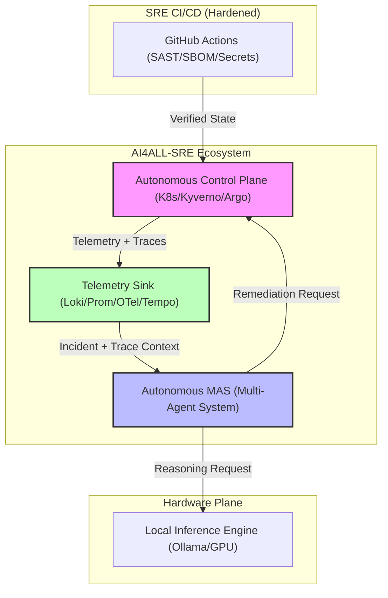
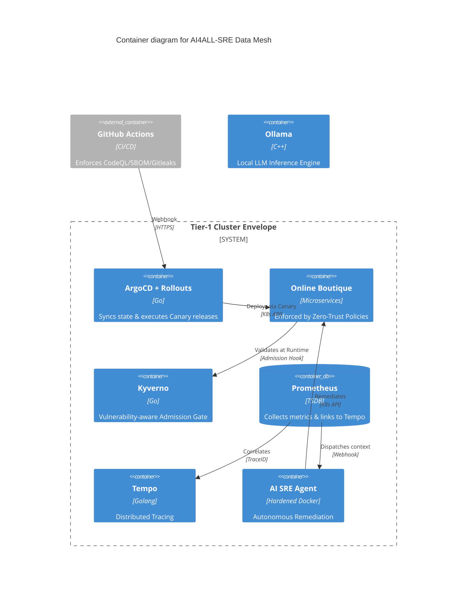
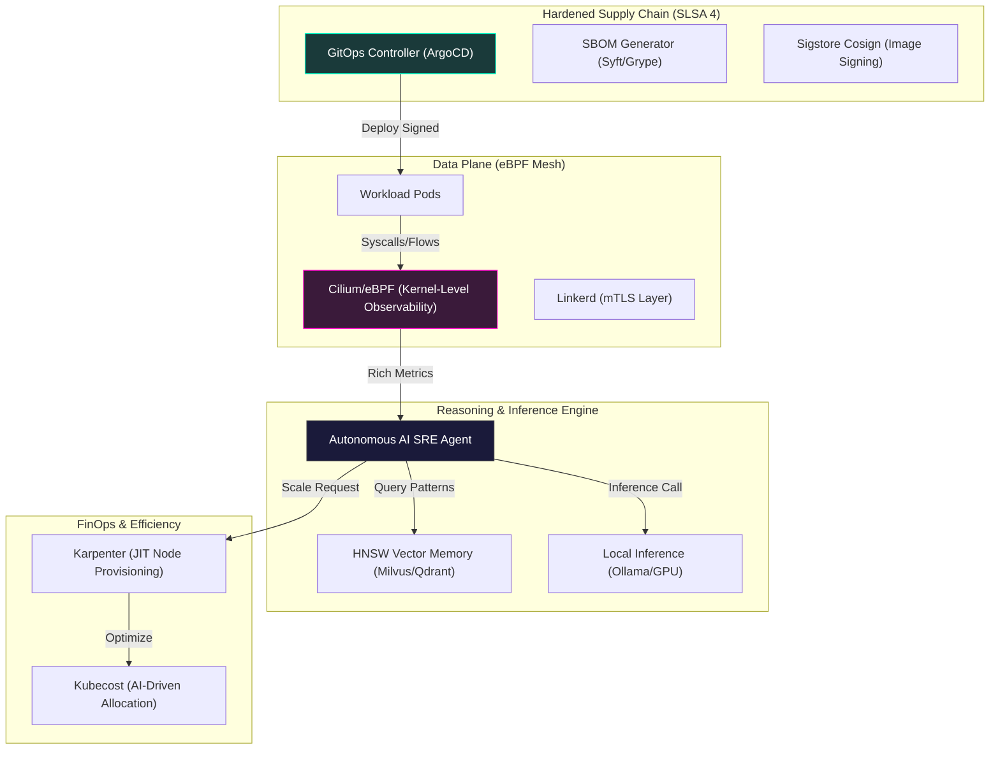
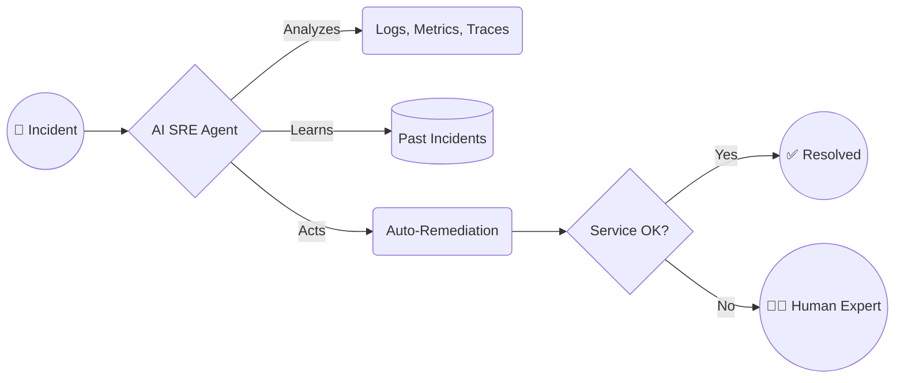

# 🏗️ Reference: System Architecture (C4 Model)
> **Tier-1 Engineering Standard: v4.2.0**

This document defines the technical architecture of the AI4ALL-SRE Laboratory. It is structured according to the **C4 Model** and documents the boundaries of the control plane, data mesh, and the autonomous reasoning engine.

---

## 🎯 Core Design Principles

1.  **Local-First Autonomy**: All reasoning (LLM) and data storage happen within the laboratory perimeter to ensure 100% data sovereignty and low-latency decision loops.
2.  **M2M Zero-Trust**: Machine-to-Machine communication is secured via explicit Linkerd **Server/Authorization** resources. Access is denied by default until an identity trust is established.
3.  **Governance-First Deployment**: Every new pod is validated by an Admission Controller (Kyverno) against live Vulnerability Data. Critical vulnerabilities block the build/deploy cycle.
4.  **Trace-Linked Alerting**: Incidents are born with a Distributed Trace context, allowing immediate correlation from a high-level alert (Prometheus) to a low-level Span (Tempo).

---

## 🏢 C4 Model - Level 1: System Context

The AI4ALL-SRE Laboratory operates as an autonomous enclave bridging the gap between raw telemetry and corrective action.



---

## 📦 C4 Model - Level 2: Container (Data Mesh)

The system is a distributed **Data Mesh** where state is synchronized across asynchronous observers.



---

## 🧩 C4 Model - Level 3: Component (MAS Reasoning)

The Autonomous SRE Agent is composed of a **Multi-Agent System (MAS)** (see `observability.tf` configmaps).

```mermaid
C4Component
    title Component diagram for AI SRE Agent

    Container_Boundary(api, "AI SRE Agent API") {
        Component(webhook, "Webhook Receiver", "FastAPI", "Receives GoAlert payload")
        
        Boundary(mas, "Specialist Swarm") {
            Component(net, "Network Agent", "LLM Context", "Analyzes Linkerd/Ingress")
            Component(db, "Database Agent", "LLM Context", "Analyzes State/Storage")
            Component(comp, "Compute Agent", "LLM Context", "Analyzes CPU/Memory")
        }
        
        Component(director, "Director Agent", "Consensus Engine", "Synthesizes final action from Swarm")
        Component(guard, "Safety Guardrail", "Python logic", "Checks APF and Kyverno rules")
        Component(exec, "K8s Executor", "client-python", "Applies patches to API server")
    }

    Rel(webhook, mas, "Dispatches context")
    Rel(net, director, "Submits hypothesis")
    Rel(db, director, "Submits hypothesis")
    Rel(comp, director, "Submits hypothesis")
    Rel(director, guard, "Proposes remediation")
    Rel(guard, exec, "Approved action")
```

---

## 🛠️ C4 Model - Level 4: Implementation Detail (SRE-Kernel Flow)

This level describes the internal logic of the Director Agent consensus loop.

| Step | Component | Action | Data Format |
| :--- | :--- | :--- | :--- |
| 1 | **Collector** | Aggregates Alert Labels + Distributed Traces. | JSON (Prometheus Webhook) |
| 2 | **MAS Dispatch** | Parallel inference across Specialist Agents. | Prompt Engineering (Few-Shot) |
| 3 | **Director** | Synthesizes a single remediation hypothesis. | Consensus Algorithm |
| 4 | **Guardrail** | Validates command safety (Whitelist/Forbidden). | Regex-based Validation |
| 5 | **Executor** | Patching the K8s API (Rollout/Scale). | Strategic Merge Patch |

---

## 🌌 High-Tech View: The Autonomous Eng Enclave (Next-Gen)

For senior engineers, this view highlights the integration of **eBPF-based observability**, **SLSA Level 4 supply chain security**, and **AI FinOps**.



---

## 💡 Simple View: Value Flow for Stakeholders

This diagram simplifies the complex engineering into the core business value: turning incidents into automated resolutions.



---

## ⏱️ Service Level Objectives (SLOs)
...
---
*Document Version: 5.0.0 (Lead Senior SRE Standard)*
