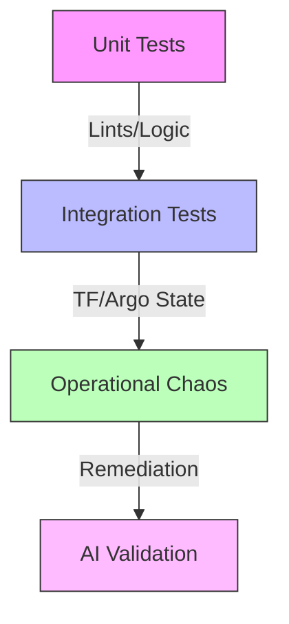

# 🧪 Testing Framework: From A to Z
> **Tier-1 Engineering Standard: v4.2.0**

Reliability in an autonomous system is not a feature; it is a requirement. This document details the multi-layered testing strategy used to validate the AI4ALL-SRE Laboratory.

---

## 🏗️ The Testing Pyramid

Our strategy follows a tiered approach to ensure stability from the code level up to the autonomous reasoning loop.



---

## 1. Unit Testing (Python & Logic)
Located in the `tests/` directory, these validate the core logic components.

| File | Coverage |
| :--- | :--- |
| `test_agent_parsing.py` | Validates regex-based extraction from LLM responses. |
| `test_ai_agent.py` | Mocks K8s API to test the remediation lifecycle. |
| `test_generate_certs.py` | Ensures PKI infrastructure adheres to security specs. |
| `test_behavioral_loadgen.py` | Validates the pattern replication of user traffic. |

**Run Command:**
```bash
python3 -m unittest discover tests/
```

---

## 2. Infrastructure Integration
Validates that our **Infrastructure-as-Code (IaC)** correctly models the desired state.

- **Terraform Linting**: Checks `*.tf` files for syntax and best practices.
- **Zero-to-Hero Lifecycle**: `lifecycle_test.sh` proves that the entire infrastructure and data mesh can be fully destroyed and rebuilt from scratch.
- **Cinematic A-Z Validation**: `cinematic_test.sh` provides a visual showcase of the full platform lifecycle, including real-time dashboards and chaos remediation.
- **Specialized AI Tests**: Validates MAS Consensus, Safety Guardrails, and Remediation Edge Cases.

**Validation Tool:**
```bash
# Run the integrated validation suite
./scripts/validate.sh
```

## 3. End-to-End & Lifecycle Validation

We employ specialized automation scripts to guarantee the end-to-end reliability of the platform.

| Validation Script | Scope | Purpose |
| :--- | :--- | :--- |
| `./e2e_test.sh` | Infrastructure & Live Endpoints | An "A-to-Z" test suite that drops an ephemeral pod inside the cluster to validate all namespaced workloads and `curl` HTTP endpoints. |
| `./lifecycle_test.sh` | Full Environment Reproducibility | The ultimate confidence check. This script performs an automated total wipe (`destroy.sh`), a from-scratch provision (`setup.sh`), and a full test run (`e2e_test.sh`). |

**Run Command:**
```bash
# Verify the active cluster health
./e2e_test.sh
```

---

## 4. Operational Chaos (The Stress Test)
We use **Chaos Mesh** to inject controlled failures into the system.

| Experiment | Target | Expected SRE Outcome |
| :--- | :--- | :--- |
| `pod-failure` | Frontend | HPA triggers or Pod restarts via ReplicaSet. |
| `network-delay` | Checkout | AI Agent detects latency and scales microservices. |
| `db-partition` | Redis | Circuit breaker trips; AI Agent restarts db-proxy. |

---

## 4. AI & LLM Validation (The "Brain" Test)
Testing an LLM is non-deterministic. We use specific metrics to judge the AI Agent's performance:

- **Hallucination Rate**: Measured by how many proposed commands fail the `Safety Guardrail`. Goal: < 1%.
- **MTTR (Mean Time to Remediation)**: Time from alert firing to service recovery. Goal: < 120s.
- **Consensus Fidelity**: Degree of agreement across the Specialist Swarm. Goal: > 90%.

---

## 🔍 How to Debug a Failed Test
1. **Check Logs**: `kubectl logs -l app=ai-agent -n observability`.
2. **Inspect Trace**: Find the `TraceID` in Grafana Tempo to see the "Waterfall of Death".
3. **Verify State**: Use `argocd app get <app-name>` to see if GitOps is stuck.

---
*QA Lead: AI4ALL-SRE Platform*
