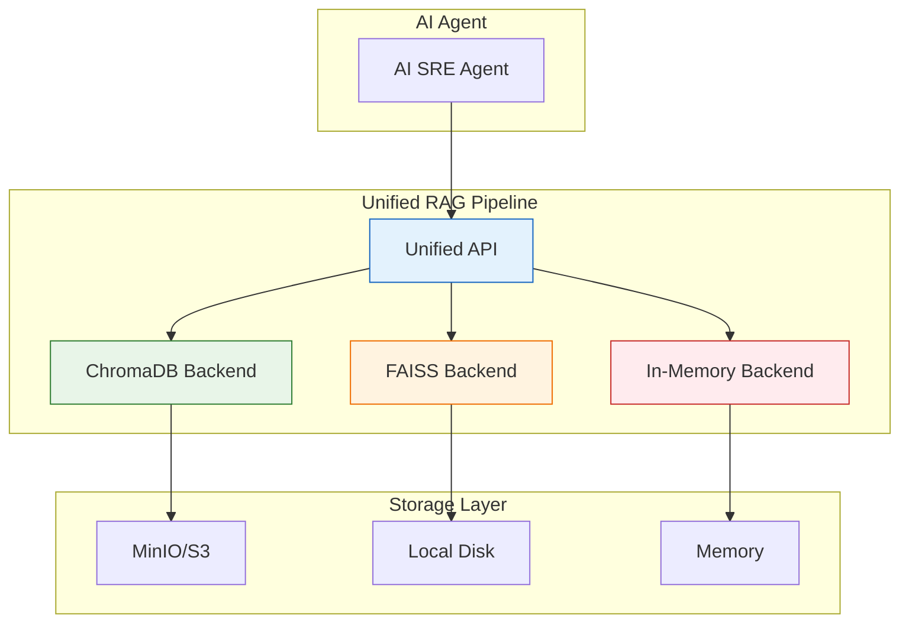

# Unified RAG Interface Reference

> **Technical Reference: v5.1.0**

This document describes the Unified RAG (Retrieval-Augmented Generation) interface in AI4ALL-SRE, which provides a consolidated vector storage solution with automatic backend fallback.

## Overview

The Unified RAG Interface consolidates multiple vector storage backends (FAISS, ChromaDB) into a single, consistent API with automatic fallback capabilities. This ensures the AI Agent always has access to historical incident context, even when preferred backends are unavailable.

## Architecture



### Backend Fallback Chain

1. **ChromaDB** (Production): Persistent storage via MinIO/S3
2. **FAISS** (Local): High-performance local vector search
3. **In-Memory** (Fallback): Simple, always-available storage

## API Reference

### RAGResult Dataclass

```python
@dataclass
class RAGResult:
    rank: int           # Result ranking (1, 2, 3...)
    similarity: float   # Similarity score (0.0 to 1.0)
    content: str        # Full document content
    metadata: Dict      # Document metadata
    excerpt: str        # Truncated excerpt (500 chars)
```

### UnifiedRAGPipeline

#### Initialization

```python
from rag_unified import get_rag_pipeline

# Get singleton instance
rag = get_rag_pipeline()
```

The pipeline automatically selects the first available backend.

#### Methods

##### embed_post_mortem

Embed a post-mortem document for future retrieval:

```python
success = rag.embed_post_mortem(
    content="Incident details...",
    alert_name="HighCPUUsage",
    timestamp="2024-01-15T10:30:00"  # Optional, defaults to now
)
```

**Parameters:**
- `content` (str): Full post-mortem content
- `alert_name` (str): Alert name for categorization
- `timestamp` (str): ISO format timestamp (optional)

**Returns:** `bool` - True if embedded successfully

##### query_similar_incidents

Query for similar past incidents:

```python
results = rag.query_similar_incidents(
    incident_description="High CPU usage on frontend",
    n_results=3  # Number of results to return
)
```

**Parameters:**
- `incident_description` (str): Description of current incident
- `n_results` (int): Number of similar incidents to return

**Returns:** `List[RAGResult]` - List of similar incidents

##### format_context_for_llm

Format query results for LLM consumption:

```python
context = rag.format_context_for_llm(
    incident_description="High CPU usage on frontend",
    n_results=3
)
```

**Parameters:**
- `incident_description` (str): Incident description for context
- `n_results` (int): Number of incidents to include

**Returns:** `str` - Formatted context string for LLM prompt

##### get_stats

Get pipeline statistics:

```python
stats = rag.get_stats()
# Returns: {
#   "primary_backend": "ChromaDBBackend",
#   "available_backends": ["ChromaDBBackend", "FAISSBackend"],
#   "document_count": 42
# }
```

## Backend Implementations

### ChromaDB Backend

Persistent storage via ChromaDB with MinIO/S3 backend.

**Configuration:**
```bash
CHROMA_HOST=chromadb.observability.svc.cluster.local
CHROMA_PORT=8000
EMBED_MODEL=all-MiniLM-L6-v2
```

**Features:**
- HNSW indexing for fast similarity search
- Persistent storage via MinIO/S3
- Cosine similarity metric
- Parallel indexing (4 threads)

### FAISS Backend

High-performance local vector search using FAISS.

**Features:**
- Sub-millisecond query latency
- HNSW index for fast approximate search
- Local storage (no network dependency)
- Sentence-transformers embeddings

### In-Memory Backend

Simple fallback for when no vector store is available.

**Features:**
- No external dependencies
- Semantic search (if sentence-transformers available)
- Keyword fallback (if dependencies missing)
- Thread-safe operations

## Usage Examples

### Basic Usage

```python
from rag_unified import get_rag_pipeline

# Initialize pipeline
rag = get_rag_pipeline()

# Embed a post-mortem
with open("post-mortems/20240115-HighCPU.md", "r") as f:
    content = f.read()

rag.embed_post_mortem(
    content=content,
    alert_name="HighCPUUsage"
)

# Query for similar incidents
results = rag.query_similar_incidents(
    "CPU usage spiked to 95% on frontend service"
)

for result in results:
    print(f"Rank {result.rank}: {result.similarity:.2%} similarity")
    print(f"Alert: {result.metadata.get('alert_name')}")
    print(f"Excerpt: {result.excerpt[:100]}...")
```

### Integration with AI Agent

```python
# In ai_agent.py
from rag_unified import get_rag_pipeline

def process_alert_background(alert):
    rag = get_rag_pipeline()
    
    # Get context for LLM
    context = rag.format_context_for_llm(
        incident_description=alert_context,
        n_results=3
    )
    
    # Use context in LLM prompt
    prompt = f"""
    Alert Context:
    {alert_context}
    
    Historical Context:
    {context}
    
    Provide root cause analysis...
    """
    
    # ... rest of processing
```

### CLI Usage

```bash
# Embed all post-mortems
python3 rag_pipeline.py embed

# Query for similar incidents
python3 rag_pipeline.py query "OOMKill in paymentservice"

# Start RAG server
python3 rag_pipeline.py serve
```

## Configuration

### Environment Variables

| Variable | Default | Description |
|----------|---------|-------------|
| `CHROMA_HOST` | chromadb.observability.svc.cluster.local | ChromaDB server host |
| `CHROMA_PORT` | 8000 | ChromaDB server port |
| `EMBED_MODEL` | all-MiniLM-L6-v2 | Sentence-transformers model |
| `MINIO_ENDPOINT` | http://minio.minio.svc.cluster.local:9000 | MinIO/S3 endpoint |
| `MINIO_ACCESS_KEY` | (required) | MinIO access key |
| `MINIO_SECRET_KEY` | (required) | MinIO secret key |
| `MINIO_BUCKET` | ai4all-sre-post-mortems | MinIO bucket name |

### Backend Selection

The pipeline automatically selects the first available backend:

1. Check ChromaDB connectivity
2. Check FAISS dependencies
3. Fall back to In-Memory

## Performance Characteristics

| Backend | Query Latency | Storage | Dependencies |
|---------|---------------|---------|--------------|
| ChromaDB | ~10ms | Persistent (S3) | Network, ChromaDB |
| FAISS | ~1ms | Local disk | FAISS, numpy |
| In-Memory | ~5ms | RAM | None |

## Testing

Run RAG pipeline tests:

```bash
# Run all tests
python3 -m unittest discover tests/

# Test specific backend
python3 -m unittest tests.test_rag_pipeline
```

## Migration Guide

### From FAISS-only to Unified RAG

Old code:
```python
# Old: Direct FAISS usage
import faiss
import numpy as np
from sentence_transformers import SentenceTransformer

model = SentenceTransformer("all-MiniLM-L6-v2")
index = faiss.IndexHNSWFlat(384, 32)
# ... manual FAISS operations
```

New code:
```python
# New: Unified RAG interface
from rag_unified import get_rag_pipeline

rag = get_rag_pipeline()
rag.embed_post_mortem(content, alert_name)
results = rag.query_similar_incidents(query)
```

### Data Migration

Existing FAISS indices are automatically migrated to the unified interface. The In-Memory backend provides compatibility for both old and new data formats.

## Troubleshooting

### Backend Not Available

**Symptoms**: Only In-Memory backend is available

**Solutions**:
1. Check ChromaDB deployment: `kubectl get pods -n observability -l app=chromadb`
2. Verify MinIO credentials are set
3. Check network connectivity to ChromaDB

### Poor Search Quality

**Symptoms**: Irrelevant results returned

**Solutions**:
1. Verify embedding model is appropriate for domain
2. Check post-mortem content quality
3. Increase `n_results` for more context
4. Consider fine-tuning embedding model

### High Memory Usage

**Symptoms**: Agent consumes excessive memory

**Solutions**:
1. Switch from In-Memory to FAISS/ChromaDB
2. Limit number of indexed documents
3. Use smaller embedding model
4. Implement document chunking

## References

- [ChromaDB Documentation](https://docs.trychroma.com/)
- [FAISS Documentation](https://faiss.ai/)
- [Sentence Transformers](https://www.sbert.net/)
- [Source Code: rag_unified.py](../../components/ai-agent/rag_unified.py)
- [Source Code: rag_pipeline.py](../../components/ai-agent/rag_pipeline.py)